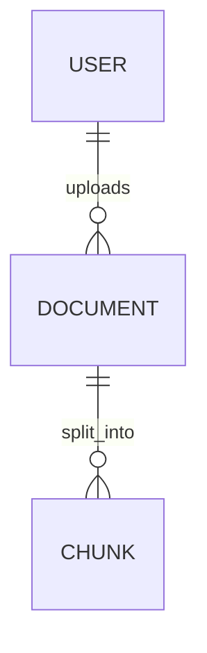

# ERD — 데이터 모델 설계

> DB 엔티티(테이블)와 관계를 설계합니다. 확정되면 `backend/app/models/` 에 SQLAlchemy 모델로,
> 마이그레이션은 Alembic 으로 반영합니다. (지금은 빈 골격 — 기능 구체화 후 채움)

## 공통 규칙 (초안, conventions.md 와 합의)
- PK 전략: _결정 예정_ (UUID vs auto-increment)
- 공통 컬럼: `created_at`, `updated_at`, (soft delete 시) `deleted_at` — _결정 예정_
- 사용자: Supabase Auth 의 `auth.users` 가 관리 → 앱 전용 프로필/도메인 테이블만 정의

## 엔티티 (초안)
_작성 예정_ — 예: 사용자 프로필 / 문서 / 청크 / 대화 / 메시지 / 진단 결과

## 관계 다이어그램
_작성 예정_ (mermaid `erDiagram` 등으로)

