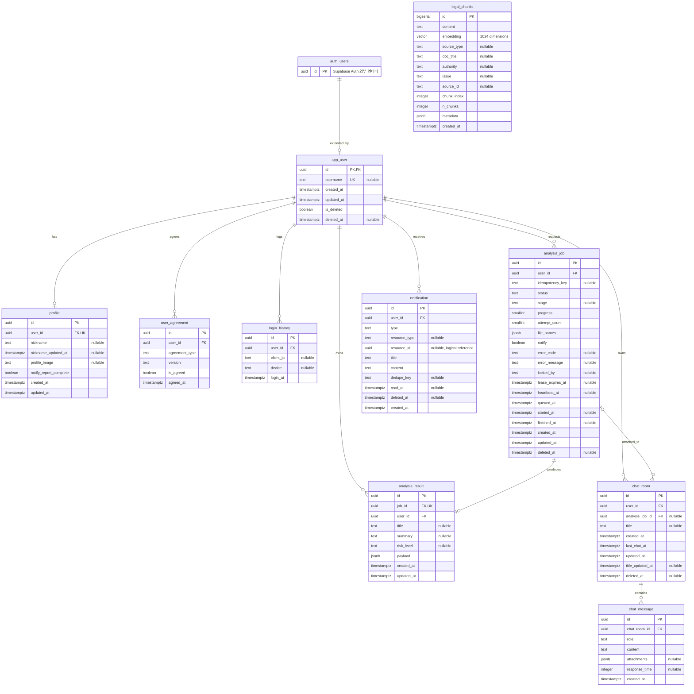

# ERD — 현재 코드 기준 데이터 모델

> 검토일: 2026-07-30
> 범위: `backend/app/models/`, `backend/app/repositories/`, `backend/app/services/`,
> `backend/app/api/`, `backend/sql/`, RAG 검색·색인 코드

이 문서는 현재 프로젝트 코드가 실제로 읽고 쓰는 테이블을 정리합니다.
운영 PostgreSQL 스키마는 [`backend/sql/schema.sql`](../backend/sql/schema.sql)을 우선 기준으로
삼고, SQLAlchemy 모델 및 런타임 참조를 교차 확인했습니다. RAG 테이블 `legal_chunks`는
주 스키마가 아니라 [`backend/test/ingest_kure.py`](../backend/test/ingest_kure.py)의 DDL과
[`backend/app/services/retrieval/search.py`](../backend/app/services/retrieval/search.py)의
조회 코드를 기준으로 작성했습니다.

> 이 검토는 저장소 코드 기준입니다. 실제 배포 DB를 introspection한 결과는 아니므로,
> 아래 삭제 후보를 DB에서 제거하기 전에는 운영 데이터 존재 여부와 저장소 밖의 참조를 별도로
> 확인해야 합니다.

## 1. 검토 결과

### 현재 ERD의 주요 문제점

| 구분 | 확인된 문제 | 정리 결과 |
|---|---|---|
| 현행·미사용 모델 혼재 | DDL에만 있고 실행 코드가 사용하지 않는 6개 테이블이 현행 엔티티처럼 표시됨 | 현행 ERD에서 분리하고 삭제 후보로 명시 |
| RAG 스키마 불일치 | 문서는 `document` → `document_chunk`를 설명하지만 런타임은 `legal_chunks`를 조회 | `legal_chunks`를 현행 테이블로 추가 |
| 누락 컬럼 | `chat_room.analysis_job_id`가 상세 표와 관계도에 없음 | 컬럼·FK·관계 추가 |
| 관계 누락 | `app_user` → `analysis_result`, `analysis_job` → `chat_room` 관계가 없음 | 실제 FK 기준으로 추가 |
| 관계 차수 오류 | `profile`, `analysis_result`를 필수 1:1처럼 설명 | 부모 기준 `1 : 0..1`로 수정 |
| 타입·NULL 표현 불명확 | 여러 컬럼을 한 행으로 묶어 서로 다른 NULL 조건을 구분할 수 없고, `progress`·`attempt_count`가 `INTEGER`로 표시됨 | 컬럼을 분리하고 실제 DDL의 `SMALLINT`, NULL, 기본값 반영 |
| 오래된 동작 설명 | 분석 입력이 임시 디렉터리에만 있어 재시작 시 실패한다고 설명 | 현재 비공개 공유 저장소와 lease 기반 복구 흐름으로 수정 |
| 문서 상태 오류 | “모델 작성 및 Alembic 반영 예정”이라고 되어 있으나 모델은 이미 존재하고 Alembic은 없음 | 현재 SQL 스크립트 기반 관리 상태로 수정 |
| 테이블 수·번호 불일치 | 13개라고 설명하지만 상세에는 15개가 있고 `11-a`, `11-b` 번호가 섞임 | 현행 10개 테이블로 재분류하고 순서 통일 |

### 현행 테이블

| 영역 | 테이블 | 사용 근거 |
|---|---|---|
| 인증·회원 | `app_user`, `profile`, `user_agreement`, `login_history` | 인증 모델·리포지토리·카카오 인증 서비스 |
| 분석 | `analysis_job`, `analysis_result` | 분석 API·리포지토리·백그라운드 워커 |
| 채팅 | `chat_room`, `chat_message` | 채팅 API·이력 저장 |
| 알림 | `notification` | 알림 API·리포지토리·분석/가입 알림 서비스 |
| RAG | `legal_chunks` | 런타임 유사도 검색과 KURE-v1 색인 스크립트 |

### 삭제 후보

아래 항목은 **현행 ERD에서는 제외**하지만, 이 문서 작업에서 실제 DB 테이블이나
`backend/sql/schema.sql`의 DDL을 삭제하지는 않았습니다.

| 테이블 | 삭제 후보 사유 | 확인해야 할 사항 |
|---|---|---|
| `message_source` | ORM 모델, 리포지토리, 서비스, API에서 참조하지 않음. 현재 채팅 답변의 검색 근거도 DB에 저장하지 않음 | 출처 저장 기능 도입 계획과 기존 행 존재 여부 |
| `feedback` | ORM 모델과 피드백 API·서비스가 없음 | 향후 사용자 피드백 기능 도입 여부와 기존 행 존재 여부 |
| `contract` | 현재 다중 파일 분석은 `analysis_job`을 사용하며 이 테이블을 읽거나 쓰는 코드가 없음 | 과거 단일 계약서 데이터의 이관·보존 필요 여부 |
| `contract_analysis` | 현재 결과는 `analysis_result`에 저장되고 이 테이블을 참조하는 코드가 없음 | `contract`와 함께 과거 결과 이관 여부 |
| `document` | 현재 RAG 검색·색인은 `legal_chunks`를 사용하며 이 테이블을 참조하지 않음 | 향후 원문 정규화 모델로 전환할 계획과 기존 데이터 여부 |
| `document_chunk` | 런타임 검색 대상이 `legal_chunks`이며 이 테이블을 참조하지 않음 | `message_source` 도입 계획, 기존 벡터 데이터 이관 여부 |

삭제 여부를 확정할 때는 운영 DB 행 수, 외부 배치·대시보드·SQL 직접 조회, 백업 및 데이터
이관 경로를 확인한 뒤 별도 마이그레이션으로 처리해야 합니다.

### 추가·수정된 항목

| 대상 | 변경 내용 | 코드 근거 |
|---|---|---|
| `legal_chunks` | 현행 RAG 테이블과 전체 컬럼·인덱스 추가 | 검색 코드의 고정 테이블명과 색인 DDL |
| `chat_room.analysis_job_id` | nullable FK 및 부분 인덱스 추가 | `schema.sql`, 채팅 문서 첨부 API |
| `analysis_job` | `SMALLINT`, 상태·단계 CHECK, 각 타임스탬프의 NULL 여부, 기본값 수정 | 모델 및 `schema.sql` |
| `analysis_result.updated_at` | 누락된 NOT NULL 컬럼과 기본값 추가 | 모델 및 `schema.sql` 후속 ALTER |
| `notification` | `dedupe_key`, 부분 인덱스, 이벤트별 UNIQUE 규칙 정리 | 모델 및 `schema.sql` |
| 관계 | `analysis_job` → `chat_room`, `app_user` → `analysis_result` 추가 | 실제 FK |
| 선택 관계 | `profile`, `analysis_result`를 `1 : 0..1`로 수정 | 자식 FK는 필수지만 부모 행 생성 시 자식 존재를 강제하지 않음 |

## 2. 공통 규칙

- 앱 데이터 테이블의 PK는 `UUID`이며 기본값은 대부분 `gen_random_uuid()`입니다.
  `app_user.id`는 Supabase `auth.users.id`를 그대로 사용합니다.
- RAG 테이블 `legal_chunks.id`만 `BIGSERIAL` PK를 사용합니다.
- 시각은 `TIMESTAMPTZ`로 저장합니다.
- 테이블·컬럼 이름은 `snake_case` 단수형입니다.
- 로그인·이메일·소셜 계정 원본은 Supabase `auth.users`가 관리하고 `app_user`가 앱 전용
  확장 정보를 보관합니다.
- PostgreSQL 운영 스키마는 현재 Alembic이 아니라 `backend/sql/*.sql` 스크립트로 관리됩니다.
- `legal_chunks`는 `RAG_DB_URL`을 사용하며, 값이 없으면 `APP_DB_URL`을 재사용합니다.
  따라서 앱 DB와 물리적으로 같을 수도, 별도 DB일 수도 있습니다.

## 3. 관계 다이어그램

`notification.resource_id`는 `resource_type='ANALYSIS_JOB'`일 때 분석 작업 ID를 담지만
DB FK는 아닙니다. `legal_chunks`도 현재 채팅 메시지와 FK로 연결되지 않으며 검색 결과는
답변 생성 시점에만 사용됩니다.

## 4. 엔티티 상세

### 4.1 `app_user` — 앱 사용자

Supabase `auth.users`의 앱 확장 정보를 저장합니다. 회원 탈퇴는 행을 삭제하지 않고
`is_deleted`와 `deleted_at`으로 표시합니다.

| 컬럼 | 타입 | NULL | 키·제약 / 기본값 | 설명 |
|---|---|---:|---|---|
| `id` | UUID | 불가 | PK, FK → `auth.users.id`, ON DELETE CASCADE | Auth 사용자 ID |
| `username` | TEXT | 허용 | UNIQUE | 서비스 핸들 |
| `created_at` | TIMESTAMPTZ | 불가 | DEFAULT `now()` | 생성 시각 |
| `updated_at` | TIMESTAMPTZ | 불가 | DEFAULT `now()` | 수정 시각 |
| `is_deleted` | BOOLEAN | 불가 | DEFAULT `false` | 탈퇴 여부 |
| `deleted_at` | TIMESTAMPTZ | 허용 |  | 탈퇴 시각 |

인덱스: `idx_app_user_withdrawn (deleted_at) WHERE is_deleted`

### 4.2 `profile` — 사용자 프로필

닉네임, 프로필 이미지, 위험 보고서 완료 알림 수신 설정을 저장합니다.

| 컬럼 | 타입 | NULL | 키·제약 / 기본값 | 설명 |
|---|---|---:|---|---|
| `id` | UUID | 불가 | PK, DEFAULT `gen_random_uuid()` | 프로필 ID |
| `user_id` | UUID | 불가 | FK → `app_user.id`, UNIQUE, ON DELETE CASCADE | 사용자 ID |
| `nickname` | TEXT | 허용 |  | 표시 닉네임 |
| `nickname_updated_at` | TIMESTAMPTZ | 허용 |  | 닉네임 수정 시각 |
| `profile_image` | TEXT | 허용 |  | 프로필 이미지 공개 URL |
| `notify_report_complete` | BOOLEAN | 불가 | DEFAULT `true` | 분석 완료 알림 수신 여부 |
| `created_at` | TIMESTAMPTZ | 불가 | DEFAULT `now()` | 생성 시각 |
| `updated_at` | TIMESTAMPTZ | 불가 | DEFAULT `now()` | 수정 시각 |

### 4.3 `user_agreement` — 약관 동의 이력

이용약관, 개인정보 처리방침, 마케팅 수신 동의를 버전별로 저장합니다.

| 컬럼 | 타입 | NULL | 키·제약 / 기본값 | 설명 |
|---|---|---:|---|---|
| `id` | UUID | 불가 | PK, DEFAULT `gen_random_uuid()` | 동의 기록 ID |
| `user_id` | UUID | 불가 | FK → `app_user.id`, ON DELETE CASCADE | 사용자 ID |
| `agreement_type` | TEXT | 불가 | CHECK (`terms`, `privacy`, `marketing`) | 동의 종류 |
| `version` | TEXT | 불가 |  | 약관 버전 |
| `is_agreed` | BOOLEAN | 불가 |  | 동의 여부 |
| `agreed_at` | TIMESTAMPTZ | 불가 | DEFAULT `now()` | 동의 시각 |

제약: `UNIQUE (user_id, agreement_type, version)`

### 4.4 `login_history` — 로그인 이력

로그인 시 사용자, IP, 기기 정보를 기록합니다. 현재 애플리케이션에서 이력 추가가 연결된
경로는 카카오 인증 흐름입니다.

| 컬럼 | 타입 | NULL | 키·제약 / 기본값 | 설명 |
|---|---|---:|---|---|
| `id` | UUID | 불가 | PK, DEFAULT `gen_random_uuid()` | 로그인 기록 ID |
| `user_id` | UUID | 불가 | FK → `app_user.id`, ON DELETE CASCADE | 사용자 ID |
| `client_ip` | INET | 허용 |  | 접속 IP |
| `device` | TEXT | 허용 |  | 접속 기기 |
| `login_at` | TIMESTAMPTZ | 불가 | DEFAULT `now()` | 로그인 시각 |

인덱스: `idx_login_history_user (user_id, login_at DESC)`

### 4.5 `analysis_job` — AI 분석 작업

다중 파일 분석 요청과 실행 상태를 저장하며, 테이블 자체가 비동기 작업 큐 역할을 합니다.
워커는 `FOR UPDATE SKIP LOCKED`로 작업을 선점합니다. 입력 파일은 비공개 공유 저장소에
보관되며, 만료된 lease는 남은 시도 횟수에 따라 재큐잉하거나 실패 처리합니다.

| 컬럼 | 타입 | NULL | 키·제약 / 기본값 | 설명 |
|---|---|---:|---|---|
| `id` | UUID | 불가 | PK, DEFAULT `gen_random_uuid()` | 작업 ID |
| `user_id` | UUID | 불가 | FK → `app_user.id`, ON DELETE CASCADE | 요청 사용자 |
| `idempotency_key` | TEXT | 허용 |  | 요청 재전송 방지 키 |
| `status` | TEXT | 불가 | DEFAULT `QUEUED`, CHECK (`QUEUED`, `RUNNING`, `SUCCEEDED`, `FAILED`, `CANCELLED`) | 작업 상태 |
| `stage` | TEXT | 허용 | CHECK (`UPLOADING`, `OCR`, `ANALYZING`, `RAG`, `LLM`, `SAVING`, `COMPLETED`) | 진행 단계 |
| `progress` | SMALLINT | 불가 | DEFAULT `0`, CHECK (`0`~`100`) | 진행률 |
| `attempt_count` | SMALLINT | 불가 | DEFAULT `0` | 실행 시도 횟수 |
| `file_names` | JSONB | 불가 | DEFAULT `[]` | 원본 파일명 목록 |
| `notify` | BOOLEAN | 불가 | DEFAULT `true` | 결과를 알림으로 알릴지. 채팅 첨부는 `false` |
| `error_code` | TEXT | 허용 |  | 실패 코드 |
| `error_message` | TEXT | 허용 |  | 사용자 표시 실패 메시지 |
| `locked_by` | TEXT | 허용 |  | 선점 워커 식별자 |
| `lease_expires_at` | TIMESTAMPTZ | 허용 |  | 작업 임대 만료 시각 |
| `heartbeat_at` | TIMESTAMPTZ | 허용 |  | 마지막 생존 신호 시각 |
| `queued_at` | TIMESTAMPTZ | 불가 | DEFAULT `now()` | 큐 진입 시각 |
| `started_at` | TIMESTAMPTZ | 허용 |  | 실행 시작 시각 |
| `finished_at` | TIMESTAMPTZ | 허용 |  | 실행 종료 시각 |
| `created_at` | TIMESTAMPTZ | 불가 | DEFAULT `now()` | 생성 시각 |
| `updated_at` | TIMESTAMPTZ | 불가 | DEFAULT `now()` | 수정 시각 |
| `deleted_at` | TIMESTAMPTZ | 허용 |  | 사용자 목록에서 숨긴 시각 |

인덱스·제약:

- `idx_analysis_job_user_alive (user_id, created_at DESC) WHERE deleted_at IS NULL`
- `idx_analysis_job_queue (queued_at) WHERE status = 'QUEUED'`
- `idx_analysis_job_lease (lease_expires_at) WHERE status = 'RUNNING'`
- `UNIQUE (user_id) WHERE status IN ('QUEUED', 'RUNNING')`
- `UNIQUE (user_id, idempotency_key) WHERE idempotency_key IS NOT NULL`

### 4.6 `analysis_result` — AI 분석 결과

성공한 분석 작업의 결과를 저장합니다. 목록 조회용 요약 컬럼과 전체 리포트 `payload`를
분리합니다. 마스킹 PDF 바이너리는 저장하지 않습니다.

| 컬럼 | 타입 | NULL | 키·제약 / 기본값 | 설명 |
|---|---|---:|---|---|
| `id` | UUID | 불가 | PK, DEFAULT `gen_random_uuid()` | 결과 ID |
| `job_id` | UUID | 불가 | FK → `analysis_job.id`, UNIQUE, ON DELETE CASCADE | 작업 ID |
| `user_id` | UUID | 불가 | FK → `app_user.id`, ON DELETE CASCADE | 소유 사용자 |
| `title` | TEXT | 허용 |  | 사용자가 수정할 수 있는 목록 제목 |
| `summary` | TEXT | 허용 |  | 목록용 요약 |
| `risk_level` | TEXT | 허용 | CHECK (`LOW`, `MEDIUM`, `HIGH`) | 위험 등급 |
| `payload` | JSONB | 불가 |  | 분석 리포트 전체 |
| `created_at` | TIMESTAMPTZ | 불가 | DEFAULT `now()` | 생성 시각 |
| `updated_at` | TIMESTAMPTZ | 불가 | DEFAULT `now()` | 수정 시각 |

인덱스: `idx_analysis_result_user (user_id, created_at DESC)`

`job_id`가 UNIQUE이므로 작업당 결과는 최대 1개입니다. 실패·대기·진행 중인 작업에는 결과가
없으므로 `analysis_job` 기준 관계는 `1 : 0..1`입니다.

### 4.7 `chat_room` — 채팅방

사용자의 채팅방과 선택적으로 첨부된 분석 작업을 저장합니다. 삭제는 `deleted_at`을 사용하는
소프트 삭제입니다.

| 컬럼 | 타입 | NULL | 키·제약 / 기본값 | 설명 |
|---|---|---:|---|---|
| `id` | UUID | 불가 | PK, DEFAULT `gen_random_uuid()` | 채팅방 ID |
| `user_id` | UUID | 불가 | FK → `app_user.id`, ON DELETE CASCADE | 소유 사용자 |
| `analysis_job_id` | UUID | 허용 | FK → `analysis_job.id`, ON DELETE SET NULL | 첨부 분석 작업 |
| `title` | TEXT | 허용 |  | 채팅방 제목 |
| `created_at` | TIMESTAMPTZ | 불가 | DEFAULT `now()` | 생성 시각 |
| `last_chat_at` | TIMESTAMPTZ | 불가 | DEFAULT `now()` | 마지막 대화 시각 |
| `updated_at` | TIMESTAMPTZ | 불가 | DEFAULT `now()` | 레코드 수정 시각 |
| `title_updated_at` | TIMESTAMPTZ | 허용 |  | 제목 수정 시각 |
| `deleted_at` | TIMESTAMPTZ | 허용 |  | 삭제 시각 |

인덱스:

- `idx_chat_room_user_last_chat (user_id, last_chat_at DESC)`
- `idx_chat_room_analysis_job (analysis_job_id) WHERE analysis_job_id IS NOT NULL`

`analysis_job_id`는 UNIQUE가 아니므로 하나의 분석 작업을 여러 채팅방에 첨부할 수 있습니다.

### 4.8 `chat_message` — 채팅 메시지

채팅방의 사용자·어시스턴트·시스템 메시지를 저장합니다.

| 컬럼 | 타입 | NULL | 키·제약 / 기본값 | 설명 |
|---|---|---:|---|---|
| `id` | UUID | 불가 | PK, DEFAULT `gen_random_uuid()` | 메시지 ID |
| `chat_room_id` | UUID | 불가 | FK → `chat_room.id`, ON DELETE CASCADE | 채팅방 ID |
| `role` | TEXT | 불가 | CHECK (`USER`, `ASSISTANT`, `SYSTEM`) | 발화 주체 |
| `content` | TEXT | 불가 |  | 메시지 내용 |
| `attachments` | JSONB | 허용 |  | 함께 보낸 첨부 `[{name, kind}]`. 이름·종류만 저장 |
| `response_time` | INTEGER | 허용 |  | AI 응답 시간(ms) |
| `created_at` | TIMESTAMPTZ | 불가 | DEFAULT `now()` | 생성 시각 |

인덱스: `idx_chat_message_room (chat_room_id, created_at)`

`attachments`는 "어느 메시지에 무엇을 붙여 보냈는가"라는 **대화 기록**입니다. "지금 이 대화가
무슨 계약서를 읽는가"는 `chat_room.analysis_job_id`가 들고 있으며, 둘은 어긋날 수 있습니다 —
새 계약서를 첨부하면 방은 최신 것만 참고하지만 옛 메시지의 첨부 표시는 그대로 남습니다.
원본 파일은 분석이 끝나면 삭제되므로 이름과 종류만 남습니다.

### 4.9 `notification` — 사용자 알림

가입 및 분석 시작·완료·실패 알림을 저장합니다. 읽음과 삭제 상태는 각각 nullable
타임스탬프로 표현합니다.

| 컬럼 | 타입 | NULL | 키·제약 / 기본값 | 설명 |
|---|---|---:|---|---|
| `id` | UUID | 불가 | PK, DEFAULT `gen_random_uuid()` | 알림 ID |
| `user_id` | UUID | 불가 | FK → `app_user.id`, ON DELETE CASCADE | 수신 사용자 |
| `type` | TEXT | 불가 | DEFAULT `GENERAL`, CHECK (`GENERAL`, `WELCOME`, `ANALYSIS_STARTED`, `ANALYSIS_COMPLETED`, `ANALYSIS_FAILED`) | 알림 종류 |
| `resource_type` | TEXT | 허용 | CHECK (`ANALYSIS_JOB`) | 연결 대상 종류 |
| `resource_id` | UUID | 허용 | FK 없음 | 연결 대상 ID |
| `title` | TEXT | 불가 |  | 알림 제목 |
| `content` | TEXT | 불가 |  | 알림 내용 |
| `dedupe_key` | TEXT | 허용 |  | 같은 사건의 중복 알림 방지 키 |
| `read_at` | TIMESTAMPTZ | 허용 |  | 읽은 시각; NULL이면 안 읽음 |
| `deleted_at` | TIMESTAMPTZ | 허용 |  | 삭제 시각; NULL이면 활성 |
| `created_at` | TIMESTAMPTZ | 불가 | DEFAULT `now()` | 생성 시각 |

인덱스·제약:

- `idx_notification_user_created (user_id, created_at DESC, id DESC) WHERE deleted_at IS NULL`
- `idx_notification_user_unread (user_id, created_at DESC, id DESC) WHERE deleted_at IS NULL AND read_at IS NULL`
- `UNIQUE (user_id, dedupe_key) WHERE dedupe_key IS NOT NULL`

`resource_id`는 다형 참조를 위한 논리 키입니다. 현재 값은 분석 작업 ID지만 FK가 없으므로
DB가 대상 존재 여부나 소유자 일치를 강제하지 않습니다.

### 4.10 `legal_chunks` — 법률 RAG 청크

법령·판례·해설·가이드 문서를 KURE-v1 임베딩과 함께 저장합니다. 런타임은 pgvector의
코사인 거리 연산으로 이 테이블을 직접 검색합니다.

| 컬럼 | 타입 | NULL | 키·제약 / 기본값 | 설명 |
|---|---|---:|---|---|
| `id` | BIGSERIAL | 불가 | PK | 청크 ID |
| `content` | TEXT | 불가 |  | 청크 본문 |
| `embedding` | VECTOR(1024) | 불가 |  | KURE-v1 임베딩 |
| `source_type` | TEXT | 허용 |  | 법령·판례·해설 등 출처 유형 |
| `doc_title` | TEXT | 허용 |  | 문서 제목 |
| `authority` | TEXT | 허용 |  | 법적 권위 분류 |
| `issue` | TEXT | 허용 |  | 검색 필터용 쟁점 |
| `source_id` | TEXT | 허용 |  | 원문 식별자 |
| `chunk_index` | INTEGER | 불가 | DEFAULT `0` | 문서 또는 레코드 내 청크 순서 |
| `n_chunks` | INTEGER | 불가 | DEFAULT `1` | 원문에서 생성된 총 청크 수 |
| `metadata` | JSONB | 불가 | DEFAULT `{}` | 출처별 가변 메타데이터 |
| `created_at` | TIMESTAMPTZ | 불가 | DEFAULT `now()` | 생성 시각 |

인덱스:

- `legal_chunks_embedding_idx USING hnsw (embedding vector_cosine_ops)`
- `legal_chunks_source_type_idx (source_type)`
- `legal_chunks_issue_idx (issue)`

이 테이블에는 다른 현행 테이블을 참조하는 FK가 없습니다. 기본 색인 도구는
`legal_chunks`를 사용하지만 `--table` 옵션으로 다른 테이블명을 지정할 수 있으므로, 운영
배치에서는 런타임의 고정 조회 대상과 같은 이름을 사용해야 합니다.

## 5. 관계 요약

| 부모 | 자식 | 관계 | FK 및 삭제 규칙 |
|---|---|---|---|
| `auth.users` | `app_user` | 1 : 0..1 | `app_user.id` → `auth.users.id`, CASCADE |
| `app_user` | `profile` | 1 : 0..1 | `profile.user_id`, UNIQUE, CASCADE |
| `app_user` | `user_agreement` | 1 : 0..N | `user_agreement.user_id`, CASCADE |
| `app_user` | `login_history` | 1 : 0..N | `login_history.user_id`, CASCADE |
| `app_user` | `analysis_job` | 1 : 0..N | `analysis_job.user_id`, CASCADE |
| `app_user` | `analysis_result` | 1 : 0..N | `analysis_result.user_id`, CASCADE |
| `app_user` | `chat_room` | 1 : 0..N | `chat_room.user_id`, CASCADE |
| `app_user` | `notification` | 1 : 0..N | `notification.user_id`, CASCADE |
| `analysis_job` | `analysis_result` | 1 : 0..1 | `analysis_result.job_id`, UNIQUE, CASCADE |
| `analysis_job` | `chat_room` | 1 : 0..N | `chat_room.analysis_job_id`, nullable, SET NULL |
| `chat_room` | `chat_message` | 1 : 0..N | `chat_message.chat_room_id`, CASCADE |

## 6. 코드와 DDL 관리 시 주의점

- PostgreSQL에서는 `schema.sql`이 스키마를 소유하고 애플리케이션 시작 시
  `Base.metadata.create_all()`을 실행하지 않습니다. 일부 ORM 모델은 FK·CHECK를 의도적으로
  생략하므로 운영 관계 확인에는 DDL을 우선해야 합니다.
- `legal_chunks` DDL은 주 `schema.sql`이 아니라 색인 스크립트에 있습니다. 스키마 변경 이력과
  배포 재현성을 위해 향후 하나의 버전 마이그레이션 체계로 통합할 필요가 있습니다.
- `notification.resource_id`는 FK가 아니므로 애플리케이션에서 대상 작업의 존재와 소유권을
  검증해야 합니다.
- `analysis_result.user_id`는 `analysis_job.user_id`와 같은 소유자를 중복 저장하지만, 두 값의
  일치를 강제하는 복합 FK나 CHECK는 현재 없습니다.
- 삭제 후보 6개 테이블은 코드에서 사용하지 않더라도 `schema.sql` 실행 시 생성됩니다.
  제거를 확정하면 문서만 고치는 것이 아니라 데이터 검증, DDL 변경, 배포 마이그레이션을
  함께 수행해야 합니다.
