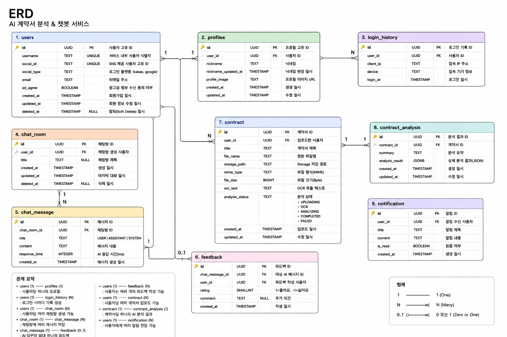
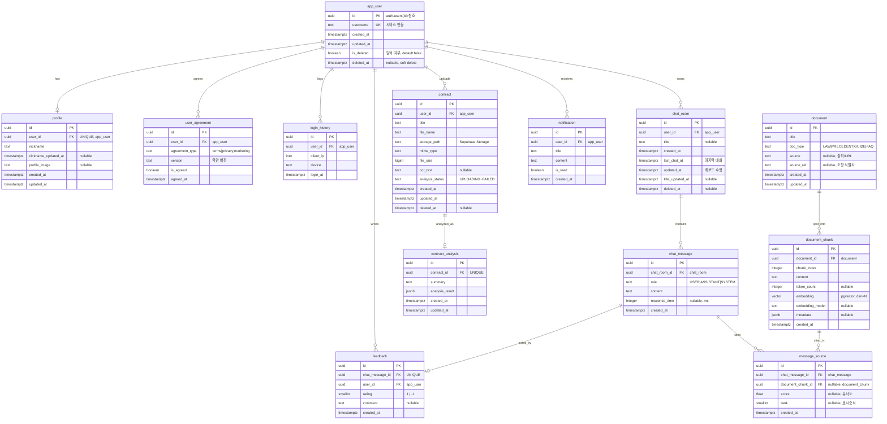

# ERD — 데이터 모델 설계

> **AI 계약서 분석 & 챗봇 서비스** 의 DB 엔티티(테이블)와 관계.
> 확정되면 `backend/app/models/` 에 SQLAlchemy 모델로, 마이그레이션은 Alembic 으로 반영합니다.
> 규칙은 [conventions.md](./conventions.md), 데이터 흐름은 [architecture.md](./architecture.md) 참고.

## 초안 설계 이미지 (v1)

> 아래 이미지는 최초 손설계(9개 테이블) 입니다. **이 문서 본문은 이 초안을 리뷰·보완한 최종본**(13개 테이블 — RAG 지식DB·약관 동의·답변 근거 추가, `auth.users` 참조, 단수 네이밍, 제약·인덱스 보강)입니다. 변경 내역은 하단 [설계 노트](#설계-노트-초안-대비-변경) 참고.

## 공통 규칙

- **PK**: `UUID` (`gen_random_uuid()`).
- **시간**: `TIMESTAMPTZ` — UTC 로 저장, 표시 시점에 로컬 변환 (conventions.md 규칙).
- **네이밍**: 테이블·컬럼 `snake_case` **단수**. 단 `user` 는 SQL 예약어라 사용자 테이블만 **`app_user`**.
  (API 경로 `/api/v1/users` 는 REST 관례상 복수 유지 — 테이블과 별개 레이어)
- **인증**: 로그인·이메일·소셜 정보는 Supabase **`auth.users`** 가 관리. `app_user.id` 가 `auth.users(id)` 를 참조하는 **앱 확장 테이블**.
- **공통 컬럼**: `created_at`·`updated_at`. 사용자가 삭제하는 엔티티엔 `deleted_at`(soft delete).
- **지식베이스(RAG)**: `document` → `document_chunk`(pgvector 임베딩). 오프라인 배치(`backend/pipeline/`)가 적재.

## 관계 다이어그램

---

## 엔티티 상세

### 1. app_user — 앱 사용자
Supabase `auth.users` 의 확장 테이블. 로그인·이메일·소셜 정보는 `auth.users` 가 보유하고, 여기엔 앱 전용 필드만 둡니다.

| 컬럼 | 타입 | 키/제약 | 설명 |
|------|------|---------|------|
| id | UUID | PK, FK→`auth.users(id)` | Supabase Auth 사용자 ID 재사용 |
| username | TEXT | UNIQUE | 서비스 핸들 (닉네임과 역할 구분) |
| created_at | TIMESTAMPTZ | | 가입 일시 |
| updated_at | TIMESTAMPTZ | | 수정 일시 |
| is_deleted | BOOLEAN | NOT NULL, DEFAULT false | 회원 탈퇴 여부 |
| deleted_at | TIMESTAMPTZ | NULL | 탈퇴(soft delete) 일시 |

> `email`·`social_id`·`social_type` 은 `auth.users` 가 관리 → 중복 저장 안 함(필요 시 join/동기화).
>
> **회원 탈퇴는 Soft Delete 다.** 조회는 반드시 `AuthRepository` 를 거쳐 탈퇴 회원을 걸러낸다.
> 탈퇴 후 3일이 지난 회원을 완전 삭제하는 배치는 **미구현** — [`회원탈퇴.md`](회원탈퇴.md) 참고.

### 2. profile — 프로필
표시용 정보. 로그인 정보(`app_user`)와 분리.

| 컬럼 | 타입 | 키/제약 | 설명 |
|------|------|---------|------|
| id | UUID | PK | 프로필 ID |
| user_id | UUID | FK→`app_user`, UNIQUE | 사용자 ID (1:1) |
| nickname | TEXT | | 닉네임 |
| nickname_updated_at | TIMESTAMPTZ | NULL | 닉네임 변경 일시 |
| profile_image | TEXT | NULL | 프로필 이미지 URL |
| created_at / updated_at | TIMESTAMPTZ | | 생성·수정 일시 |

### 3. user_agreement — 약관·동의 이력
온보딩(이용약관·개인정보 동의)과 마케팅 수신 동의를 **버전·시점과 함께** 보관.

| 컬럼 | 타입 | 키/제약 | 설명 |
|------|------|---------|------|
| id | UUID | PK | 동의 기록 ID |
| user_id | UUID | FK→`app_user` | 사용자 ID |
| agreement_type | TEXT | CHECK(`terms`\|`privacy`\|`marketing`) | 동의 종류 |
| version | TEXT | | 동의한 약관 버전 |
| is_agreed | BOOLEAN | | 동의 여부 |
| agreed_at | TIMESTAMPTZ | | 동의 일시 |
| — | | UNIQUE(user_id, agreement_type, version) | 버전별 1건 |

> 초안의 `users.ad_agree` 는 `agreement_type='marketing'` 행으로 흡수.

### 4. login_history — 로그인 이력

| 컬럼 | 타입 | 키/제약 | 설명 |
|------|------|---------|------|
| id | UUID | PK | 로그인 기록 ID |
| user_id | UUID | FK→`app_user` | 사용자 ID |
| client_ip | INET | | 접속 IP |
| device | TEXT | | 접속 기기 |
| login_at | TIMESTAMPTZ | | 로그인 일시 |
| — | | INDEX(user_id, login_at DESC) | 최신 이력 조회 |

### 5. chat_room — 채팅방

| 컬럼 | 타입 | 키/제약 | 설명 |
|------|------|---------|------|
| id | UUID | PK | 채팅방 ID |
| user_id | UUID | FK→`app_user` | 생성 사용자 |
| title | TEXT | NULL | 채팅방 제목 |
| created_at | TIMESTAMPTZ | | 생성 일시 |
| last_chat_at | TIMESTAMPTZ | | 마지막 대화 일시 (없으면 생성 일시) |
| updated_at | TIMESTAMPTZ | | 레코드 수정 일시 |
| title_updated_at | TIMESTAMPTZ | NULL | 제목 수정 일시 |
| deleted_at | TIMESTAMPTZ | NULL | 삭제 일시 |
| — | | INDEX(user_id, last_chat_at DESC) | 최신순 목록 |

### 6. chat_message — 대화 메시지

| 컬럼 | 타입 | 키/제약 | 설명 |
|------|------|---------|------|
| id | UUID | PK | 메시지 ID |
| chat_room_id | UUID | FK→`chat_room` | 채팅방 ID |
| role | TEXT | CHECK(`USER`\|`ASSISTANT`\|`SYSTEM`) | 발화 주체 |
| content | TEXT | | 메시지 내용 |
| response_time | INTEGER | NULL | AI 응답 시간(ms, ASSISTANT 만) |
| created_at | TIMESTAMPTZ | | 생성 일시 |
| — | | INDEX(chat_room_id, created_at) | 방별 순서 조회 |

### 7. message_source — 답변 근거(인용) ★신규
ASSISTANT 답변이 참조한 지식베이스 청크를 기록 → **출처 인용 표시** + 검색 품질 관찰.

| 컬럼 | 타입 | 키/제약 | 설명 |
|------|------|---------|------|
| id | UUID | PK | 근거 ID |
| chat_message_id | UUID | FK→`chat_message` | 대상 ASSISTANT 메시지 |
| document_chunk_id | UUID | FK→`document_chunk`, NULL | 인용된 청크 |
| score | FLOAT | NULL | 검색 유사도 점수 |
| rank | SMALLINT | NULL | 표시 순서 |
| created_at | TIMESTAMPTZ | | 생성 일시 |
| — | | INDEX(chat_message_id) | 메시지별 근거 조회 |

### 8. feedback — 답변 피드백

| 컬럼 | 타입 | 키/제약 | 설명 |
|------|------|---------|------|
| id | UUID | PK | 피드백 ID |
| chat_message_id | UUID | FK→`chat_message`, **UNIQUE** | 대상 AI 메시지 (답변당 1건) |
| user_id | UUID | FK→`app_user` | 작성 사용자 |
| rating | SMALLINT | CHECK(rating IN (-1, 1)) | 1=좋아요, -1=싫어요 |
| comment | TEXT | NULL | 추가 의견 |
| created_at | TIMESTAMPTZ | | 작성 일시 |

> `UNIQUE(chat_message_id)` 로 "답변당 피드백 최대 1개(0~1)" 를 DB 레벨에서 강제.

### 9. contract — 계약서

| 컬럼 | 타입 | 키/제약 | 설명 |
|------|------|---------|------|
| id | UUID | PK | 계약서 ID |
| user_id | UUID | FK→`app_user` | 업로드 사용자 |
| title | TEXT | | 계약서 제목 |
| file_name | TEXT | | 원본 파일명 |
| storage_path | TEXT | | Supabase Storage 경로 |
| mime_type | TEXT | | 파일 형식(MIME) |
| file_size | BIGINT | | 파일 크기(Byte) |
| ocr_text | TEXT | NULL | OCR 추출 텍스트 |
| analysis_status | TEXT | CHECK(`UPLOADING`\|`OCR`\|`ANALYZING`\|`COMPLETED`\|`FAILED`) | 분석 상태 |
| created_at / updated_at | TIMESTAMPTZ | | 업로드·수정 일시 |
| deleted_at | TIMESTAMPTZ | NULL | 삭제 일시 (일관성 위해 추가) |
| — | | INDEX(user_id, created_at DESC) | 내 계약서 목록 |

### 10. contract_analysis — AI 분석 결과
동일 계약서를 반복 분석하지 않도록 결과를 재사용.

| 컬럼 | 타입 | 키/제약 | 설명 |
|------|------|---------|------|
| id | UUID | PK | 분석 결과 ID |
| contract_id | UUID | FK→`contract`, UNIQUE | 계약서 ID (1:1) |
| summary | TEXT | | 분석 요약 |
| analysis_result | JSONB | | 상세 분석 결과(JSON) |
| created_at / updated_at | TIMESTAMPTZ | | 생성·수정 일시 |

### 11. notification — 알림

| 컬럼 | 타입 | 키/제약 | 설명 |
|------|------|---------|------|
| id | UUID | PK | 알림 ID |
| user_id | UUID | FK→`app_user` | 수신 사용자 |
| title | TEXT | | 알림 제목 |
| content | TEXT | | 알림 내용 |
| is_read | BOOLEAN | | 읽음 여부 |
| created_at | TIMESTAMPTZ | | 생성 일시 |
| — | | INDEX(user_id, is_read) | 안읽음 조회 |

### 12. document — 지식베이스 원문 메타 ★신규
RAG 검색 대상인 법령·판례·가이드 원문의 메타데이터.

| 컬럼 | 타입 | 키/제약 | 설명 |
|------|------|---------|------|
| id | UUID | PK | 문서 ID |
| title | TEXT | | 문서 제목 |
| doc_type | TEXT | CHECK(`LAW`\|`PRECEDENT`\|`GUIDE`\|`FAQ` …) | 문서 유형 |
| source | TEXT | NULL | 출처/URL |
| source_ref | TEXT | NULL | 법령 조항 식별자 등 |
| created_at / updated_at | TIMESTAMPTZ | | 생성·수정 일시 |

### 13. document_chunk — 청크 + 벡터 임베딩 ★신규
문서를 검색 단위로 자른 청크. 임베딩은 **별도 테이블이 아니라 이 행의 `vector` 컬럼**으로 저장(pgvector 표준).

| 컬럼 | 타입 | 키/제약 | 설명 |
|------|------|---------|------|
| id | UUID | PK | 청크 ID |
| document_id | UUID | FK→`document` | 원문 ID |
| chunk_index | INTEGER | | 문서 내 순서 |
| content | TEXT | | 청크 텍스트 |
| token_count | INTEGER | NULL | 토큰 수 |
| embedding | VECTOR(N) | | pgvector 임베딩 (차원 N 은 모델 확정 후) |
| embedding_model | TEXT | NULL | 임베딩 모델명 (교체 대비) |
| metadata | JSONB | NULL | 부가 정보 |
| created_at | TIMESTAMPTZ | | 생성 일시 |
| — | | INDEX USING hnsw (embedding vector_cosine_ops) | 벡터 유사도 검색 |

> `backend/pipeline/build_index.py` 가 `data/` 원본 → 청킹 → 임베딩 → 이 테이블에 적재.

---

## 관계 요약

| Parent | Child | 관계 | 설명 |
|--------|-------|------|------|
| app_user | profile | 1 : 1 | 사용자당 프로필 하나 |
| app_user | user_agreement | 1 : N | 약관/개인정보/마케팅 동의 이력 |
| app_user | login_history | 1 : N | 로그인 시마다 기록 |
| app_user | chat_room | 1 : N | 사용자당 채팅방 여러 개 |
| chat_room | chat_message | 1 : N | 채팅방에 메시지 여러 개 |
| chat_message | feedback | 1 : 0~1 | 답변당 피드백 최대 하나 (UNIQUE) |
| chat_message | message_source | 1 : N | 답변당 근거 청크 여러 개 |
| document_chunk | message_source | 1 : N | 한 청크가 여러 답변에 인용 |
| app_user | contract | 1 : N | 사용자당 계약서 여러 개 |
| contract | contract_analysis | 1 : 1 | 계약서당 분석 결과 하나 |
| app_user | notification | 1 : N | 사용자에게 알림 여러 개 |
| document | document_chunk | 1 : N | 문서 → 청크 분할 |

---

## 설계 노트 (초안 대비 변경)

- **신규 테이블**: `user_agreement`(약관 동의), `document`·`document_chunk`(RAG 지식베이스), `message_source`(답변 근거).
- **`users` → `app_user`**: `user` 는 SQL 예약어 → `app_user`. Supabase `auth.users(id)` 참조, 중복 auth 필드(email·social_id·social_type) 제거.
- **네이밍**: 테이블 이름 전부 단수로 통일.
- **타입·제약 보강**: 모든 `TIMESTAMP` → `TIMESTAMPTZ`, enum성 컬럼에 CHECK, `feedback`/`contract_analysis` 에 UNIQUE, FK·조회용 INDEX 명시.
- **soft delete 일관성**: `contract` 에도 `deleted_at` 추가.

> 다음 단계: 이 문서를 기준으로 `backend/app/models/` 에 SQLAlchemy 모델 작성 + Alembic 마이그레이션. (pgvector 확장은 Supabase 대시보드에서 활성화)
