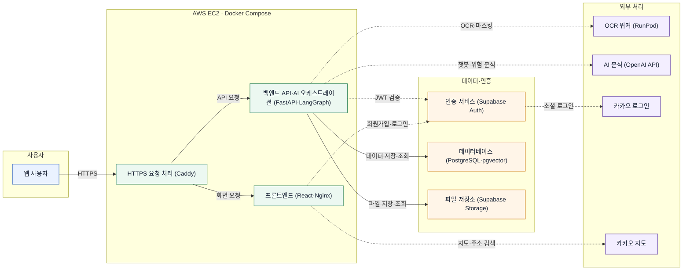
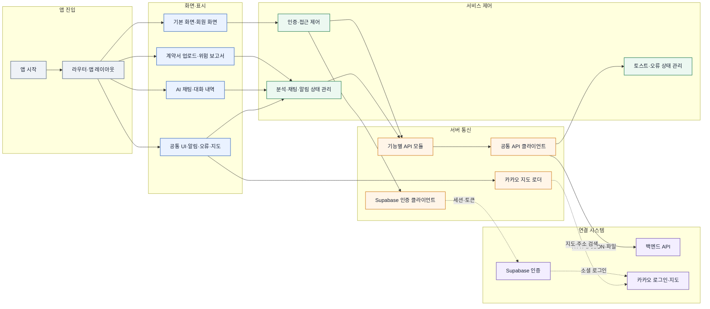
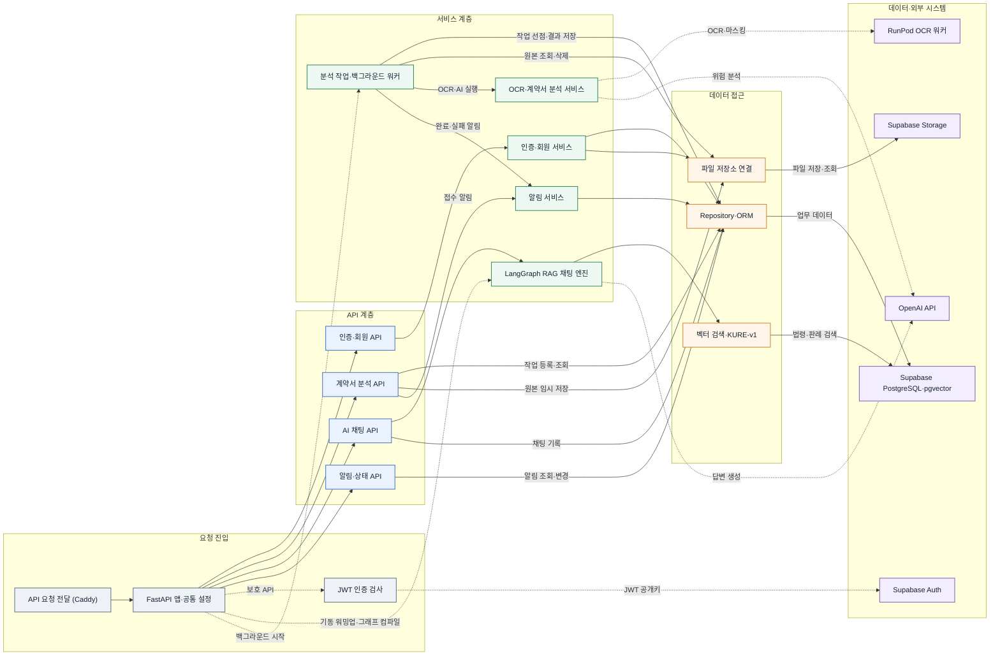
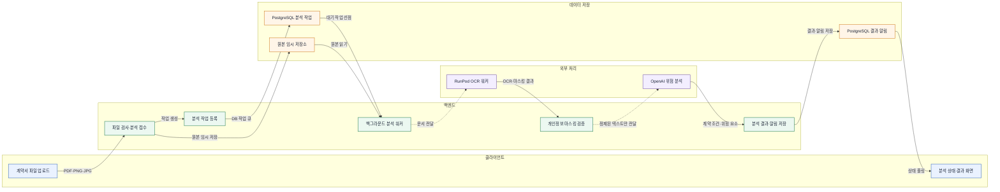
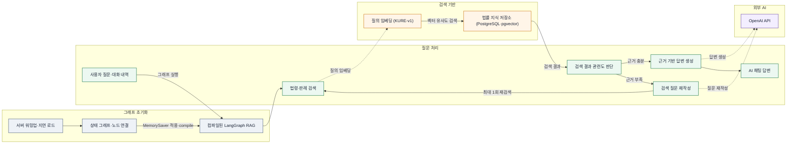

# HomeShield 시스템 구조도

HomeShield는 전·월세 계약서를 분석하고, 임대차 관련 질문에 법령·판례를 근거로 답변하는 웹 서비스다.

## 1. 전체 시스템 구성도

서비스 전체에서 실제로 연결된 시스템만 간단히 표현했다.

## 2. 클라이언트 시스템 구조도

프론트엔드는 화면, 동작 제어, 서버 통신 영역으로 나뉜다. 화면에서 발생한 요청은 기능별 API 모듈과 공통 API 클라이언트를 거쳐 백엔드로 전달된다.

### 클라이언트 구성 요소

| 영역 | 실제 코드 역할 |
| --- | --- |
| 앱 진입 | `main.tsx`, `routes.tsx`, `App.tsx` |
| 화면·표시 | `pages/`, `components/` |
| 서비스 제어 | 인증, 분석, 알림, 사용자 상태를 관리하는 `hooks/`와 상태 Store |
| 서버 통신 | `api/`의 기능별 모듈과 공통 `client.ts` |
| 인증 연결 | Supabase Client, Kakao OAuth |
| 지도 연결 | Kakao Maps SDK Loader |

## 3. 서버 시스템 구조도

백엔드는 API 계층, 서비스 계층, 데이터 접근 계층으로 구분된다. 계약서 분석 Worker는 별도 서버가 아니라 FastAPI 프로세스 안에서 실행되는 백그라운드 Worker다.

### 서버 구성 요소

| 영역 | 실제 코드 역할 |
| --- | --- |
| 요청 진입 | Caddy Reverse Proxy, FastAPI 앱, 공통 예외·인증 처리 |
| API 계층 | `api/routes/`의 인증, 회원, 분석, 채팅, 알림 API |
| 서비스 계층 | 사용자 처리, 분석 Worker, OCR Client, LLM 분석, LangGraph RAG, 알림 |
| 데이터 접근 | Repository, SQLAlchemy, psycopg 연결 Pool |
| 파일 저장소 연결 | 분석 원본과 프로필 이미지를 Supabase Storage에 저장 |
| 외부 처리 | RunPod OCR Worker와 OpenAI API 호출 |

## 4. OCR 및 AI 처리 구조도

계약서 분석은 API 요청 안에서 바로 완료되지 않는다. 파일과 작업을 먼저 저장한 뒤, 백그라운드 Worker가 OCR과 AI 분석을 순서대로 실행한다.

## 5. LangGraph RAG 처리 구조도

LangGraph RAG는 AI 채팅 API가 사용하는 백엔드 내부 구성 요소다. 서버 워밍업 또는 최초 채팅 요청 시 상태 그래프를 조립하고 `MemorySaver` 체크포인터와 함께 컴파일한다. 이후 사용자 질문마다 컴파일된 그래프를 실행한다.

계약서 위험 분석은 이 그래프를 사용하지 않으며, 앞의 OCR 및 AI 처리 흐름에서 별도 서비스로 실행된다.

## 확인된 구성과 제외 항목

| 항목 | 확인 결과 |
| --- | --- |
| AWS EC2 | 운영용 Docker Compose와 배포 문서에서 확인 |
| Docker | Frontend, Backend, OCR Worker Dockerfile과 Compose 설정 확인 |
| Nginx | Frontend 정적 파일 제공과 SPA Routing 설정 확인 |
| RunPod | Backend OCR 주소와 RunPod 전용 이미지 Workflow에서 확인 |
| Database | Supabase PostgreSQL과 pgvector 사용 확인 |
| Storage | Supabase Storage의 분석 원본·프로필 이미지 저장 확인 |
| 인증 | Supabase Auth, JWT 검증, Kakao OAuth 확인 |
| AI | LangGraph RAG 챗봇과 OpenAI API의 질문 재작성·답변 생성·계약서 분석 호출 확인 |
| Redis·Celery | 사용하지 않음. PostgreSQL `analysis_job`이 작업 큐 역할 수행 |
| 정부24·인터넷등기소 | 단순 외부 링크이며 API 연동은 없음 |

## 주요 확인 파일

- [`docker-compose.prod.yml`](../docker-compose.prod.yml)
- [`deploy/Caddyfile`](../deploy/Caddyfile)
- [`frontend/src/routes.tsx`](../frontend/src/routes.tsx)
- [`frontend/src/api/client.ts`](../frontend/src/api/client.ts)
- [`backend/app/main.py`](../backend/app/main.py)
- [`backend/app/api/deps.py`](../backend/app/api/deps.py)
- [`backend/app/services/analysis_jobs/runner.py`](../backend/app/services/analysis_jobs/runner.py)
- [`backend/app/services/document_processing/client.py`](../backend/app/services/document_processing/client.py)
- [`backend/app/agent/graph_rag.py`](../backend/app/agent/graph_rag.py)
