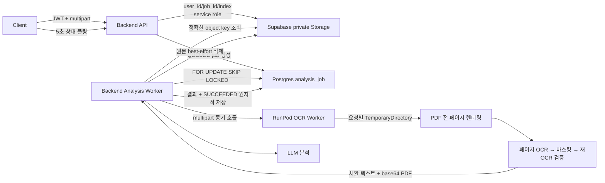

# OCR 안정화, PDF 지원 및 사용자 데이터 격리 검증 보고서

- 작성일: 2026-07-30
- 검토 대상: 현재 저장소의 Backend, Supabase Storage/DB 접근 코드, RunPod OCR Worker, Frontend 폴링 구조
- 검토 방식: 실제 코드·배포 설정 정적 분석 + 라이브 RunPod/Supabase 프로브 + 동시 요청 재현 결과 통합

## 1. 요약

PDF OCR은 코드상 지원될 뿐 아니라 라이브 RunPod에서 정상 동작하는 것이 확인됐다. 1페이지 PDF는 70.0초, 2페이지 PDF는 68.6초에 모두 `200 OK`였고, 2페이지의 텍스트와 마스크 수가 정확히 두 배로 확인되어 전체 페이지가 순서대로 처리된다. Poppler, `pdf2image`, `pdftoppm`은 사용하지 않으며 PyMuPDF만 필요하다.

OCR 핵심 경로의 사용자 데이터 격리도 구조와 라이브 프로브에서 모두 확인됐다. 서로 다른 문서 3건을 동시에 처리해 응답이 섞이지 않았고, `analysis-inputs` 버킷은 private이며 객체 키는 `user_id/job_id/index` 구조다.

현재 확정된 가장 중요한 문제는 데이터 혼합이 아니라 동시성 UX와 처리량이다.

1. 같은 사용자의 동시 업로드가 DB Unique Constraint로 안전하게 차단되지만 API가 이를 409가 아닌 500으로 반환한다.
2. 손상된 PDF가 입력 오류 4xx가 아니라 Worker 500으로 분류되어 같은 파일을 최대 3번 재시도한다.
3. Backend Worker 동시성이 1이라 현재 처리량으로 10명 동시 3파일 요청 시 마지막 사용자는 약 20분 대기할 수 있다.
4. 배포 서버 외 팀원 로컬 Worker가 동일 DB Queue를 선점하지 않도록 운영 소유권을 분리해야 한다.
5. GPU Memory·누수·Queue 지표가 수집되지 않아 30/50/100명 부하에 대한 운영 판단 근거가 부족하다.

별도 보안 심층 검토에서 채팅방과 분석 결과 사이의 동일 사용자 관계가 DB 복합 FK로 강제되지 않는 방어 공백도 확인됐다. 일반 OCR/분석 API와 Storage 격리는 정상이나, 과거 `chat_rls.sql`의 직접 DML 권한이 실제 DB에 남아 있다면 채팅 첨부 경로는 추가 방어가 필요하다.

## 2. 현재 데이터 흐름



주요 코드 위치:

- 분석 접수 및 202 응답: `backend/app/api/routes/analysis.py`
- Storage 저장·다운로드·삭제: `backend/app/services/analysis_jobs/input_store.py`
- DB 작업 큐 선점 및 상태 변경: `backend/app/repositories/analysis_job.py`
- 분석 워커: `backend/app/services/analysis_jobs/runner.py`
- Backend → OCR Worker 요청: `backend/app/services/document_processing/client.py`
- OCR Worker 요청 처리: `ocr-worker/app/main.py`
- PDF 렌더링: `ocr-worker/app/document/pdf_renderer.py`
- OCR·마스킹 파이프라인: `ocr-worker/app/pipeline/contract_pipeline.py`

## 3. 주요 발견 사항

| 우선순위 | 문제 | 영향 |
|---|---|---|
| P1 | 같은 사용자 동시 업로드의 IntegrityError가 500으로 반환됨 | 정상 더블클릭이 서버 장애로 집계 |
| P1 | 손상된 PDF가 Worker 500으로 분류됨 | 성공 가능성 없는 OCR을 최대 3회 반복 |
| P1 | 배포 외 Backend Worker도 공용 DB Queue를 선점할 수 있음 | 구버전 로컬 코드가 운영 작업 처리 가능 |
| P1 | Backend Worker 동시성 1 및 낮은 처리량 | 10명 이상에서 Queue 대기 급증 |
| P1 | 채팅 첨부의 동일 사용자 관계가 DB에서 강제되지 않음 | 과거 직접 DB 권한이 남으면 조건부 노출 가능 |
| P2 | lease fencing 없음 | 매우 긴 정지/설정 변경 시 같은 작업 중복 종료 가능 |
| P2 | 요청·메모리 backpressure 부족 | 대용량 동시 업로드 시 RAM/디스크 증가 |
| P2 | Storage 삭제 실패 회수 장치 없음 | 원본 개인정보 Orphan 가능 |
| P2 | GPU·Queue·Memory Monitoring 없음 | 용량 계획과 누수 판단 불가 |
| P3 | 미사용 base64 PDF 왕복 및 페이지 재OCR | 네트워크·GPU 시간 증가 |

## 4. 사용자 데이터 격리 검증

### 4.1 정상적으로 격리된 부분

- Storage 객체 경로는 `user UUID/job UUID/index`이므로 동일 파일명 충돌이 없다.
- 원본 파일명은 Storage 경로에 사용하지 않는다.
- `bucket.list()` 또는 첫 파일을 선택하는 로직이 없다.
- 분석 상세·목록은 JWT의 사용자 ID를 조건에 포함한다.
- OCR Worker는 `TemporaryDirectory`를 사용하므로 `/tmp/input.pdf` 같은 요청 간 충돌이 없다.
- 결과 저장은 `analysis_result` 생성과 `SUCCEEDED` 전환을 같은 트랜잭션에 묶는다.

라이브 Worker에 서로 다른 서류 3건을 동시에 전송한 결과도 다음과 같았다.

| 요청 | 처리 구간 | 결과 길이 | 입력 고유 문구 |
|---|---:|---:|---|
| 계약서 | 0.0~63.5초 | 502자 | `임대차` 포함 |
| 등기부등본 | 0.1~41.6초 | 411자 | `등기` 포함 |
| 건축물대장 | 0.1~21.3초 | 364자 | `건축` 포함 |

- 서로 다른 응답 본문 수: 3/3
- 각 응답은 자기 입력의 고유 문구만 포함
- 응답 뒤바뀜 없음
- 요청별 Job ID는 `uuid.uuid4()`와 DB PK로 고유

Storage 프로브에서도 다음 결과를 확인했다.

```text
load(자기 user_id, job_id) = 성공
load(다른 user_id, 같은 job_id) = AppError(업로드한 파일을 찾지 못함)
```

관련 코드:

```text
backend/app/services/analysis_jobs/input_store.py
backend/app/api/routes/analysis.py
backend/app/repositories/analysis_job.py
ocr-worker/app/main.py
```

### 4.2 OCR 격리와 별개인 채팅 첨부 방어 공백

일반 OCR 접수·Storage·결과 조회 경로에서는 사용자 간 데이터 혼합을 확인하지 못했다. 다만 별도의 채팅 첨부 경로는 DB 수준의 추가 방어가 필요하다.

`backend/sql/chat_rls.sql`은 과거 사용자가 자기 `chat_room` 행을 직접 수정하던 구조의 정책이며, `analysis_job_id`가 같은 사용자의 작업인지 검사하지 않는다.

DB의 FK도 다음과 같이 작업 ID만 확인한다.

```text
chat_room.analysis_job_id
    → analysis_job.id
```

채팅 문맥 로더는 방 소유권을 확인한 뒤 분석 결과를 `job_id`만으로 조회한다.

```python
result = AnalysisJobRepository(db).get_result(room.analysis_job_id)
```

현재 Frontend는 Backend API를 사용하며 Backend의 정상 첨부 API는 작업 소유권을 확인한다. 따라서 다음 경로는 정상 UI/API에서 재현된 문제가 아니라, 배포 DB에 과거 직접 DML 권한이 남아 있고 공격자가 타 사용자의 작업 UUID를 얻은 경우에만 성립하는 방어 심층화 항목이다.

```text
피해자 job UUID 획득
→ 공격자가 자기 chat_room.analysis_job_id에 직접 기록
→ Backend가 해당 방은 공격자 소유라고 확인
→ 분석 결과는 job_id만으로 읽음
→ 피해자 sanitized_text가 채팅 LLM 문맥으로 전달
```

현재 Frontend는 이미 Supabase 테이블을 직접 수정하지 않고 Backend API를 사용한다. 실제 DB 권한을 조회해 과거 `authenticated` 직접 DML 권한이 남아 있다면 제거하고, `(analysis_job_id, user_id)` 복합 FK와 결과 조회의 `user_id` 조건을 추가하는 것이 안전하다.

수정 대상:

```text
backend/app/api/routes/chat.py
backend/app/repositories/analysis_job.py
backend/sql/chat_rls.sql
backend/sql/schema.sql
```

## 5. Supabase Storage 및 RLS 검토

### 5.1 현재 Storage 접근 방식

Backend는 Supabase Service Role Key로 다음 객체만 직접 접근한다.

```text
{user_id}/{job_id}/000
{user_id}/{job_id}/001
...
```

OCR Worker가 Supabase 전체를 탐색하거나 `bucket.list()`를 호출하지 않는다. Backend가 정확한 객체를 다운로드한 뒤 파일 바이트를 OCR Worker에 전달한다.

### 5.2 라이브 Supabase 확인 결과

라이브 프로젝트에서 확인된 버킷은 다음과 같다.

| 버킷 | Public | 설정/판정 |
|---|---|---|
| `avatars` | `true` | 프로필 이미지용 의도된 공개 버킷 |
| `analysis-inputs` | `false` | PDF/PNG/JPEG, 객체당 20MB 제한 |
| `analysis-uploads` | `false` | 현재 코드에서 참조되지 않는 고아 버킷 |

접근 프로브 결과:

| 접근 방법 | 결과 |
|---|---|
| `/object/public/analysis-inputs/{key}` 인증 없음 | `400 NoSuchBucket` |
| `/object/authenticated/...` 헤더 없음 | 인증 필요 |
| `/object/authenticated/...` Service Role | `200 OK` |

따라서 현재 `analysis-inputs`가 Public으로 노출된 상태는 아니다.

다만 Backend가 Service Role Key를 사용하므로 Storage RLS는 Backend 내부 호출을 제한하는 경계가 아니다. 실제 격리 경계는 `input_store.py`의 `user_id/job_id/index` 객체 키 조립과 호출부가 넘기는 사용자 ID다. 이 코드는 보안 중요 코드로 취급해야 한다.

Backend 설정에 Supabase Anon Key가 없어 실제 사용자 JWT/Anon Key 조합을 이용한 Storage 접근은 이번 프로브에서 확인하지 못했다. 버킷이 Private이므로 차단되는 것이 정상이나 배포 전 별도 음성 테스트가 필요하다.

또한 저장소에는 `analysis_job`, `analysis_result`의 RLS·직접 권한을 명시하는 배포 SQL이 없다. 다음 쿼리로 실제 DB 상태를 확인해야 한다.

```sql
select id, name, public
from storage.buckets
where id = 'analysis-inputs';

select schemaname, tablename, policyname, roles, cmd, qual, with_check
from pg_policies
where schemaname in ('public', 'storage')
order by schemaname, tablename, policyname;

select c.relname, c.relrowsecurity
from pg_class c
join pg_namespace n on n.oid = c.relnamespace
where n.nspname = 'public'
  and c.relname in ('analysis_job', 'analysis_result', 'chat_room');

select table_name, grantee, privilege_type
from information_schema.role_table_grants
where table_schema = 'public'
  and table_name in ('analysis_job', 'analysis_result', 'chat_room')
order by table_name, grantee, privilege_type;
```

API 전용 구조라면 다음처럼 직접 권한을 제거하는 방법이 가장 단순하다.

```sql
alter table public.analysis_job enable row level security;
alter table public.analysis_result enable row level security;

revoke all on public.analysis_job from anon, authenticated;
revoke all on public.analysis_result from anon, authenticated;
revoke insert, update, delete on public.chat_room from authenticated;
revoke insert, update, delete on public.chat_message from authenticated;
```

Storage는 Service Role만 접근하도록 하고 사용자용 Storage 정책은 만들지 않는 구성이 적합하다.

## 6. PDF 지원 여부 및 실패 원인

### 6.1 PDF 지원은 구현되어 있음

현재 구현은 다음 과정을 지원한다.

- Backend에서 `.pdf` 확장자 허용
- Backend → OCR Worker 전송 시 `application/pdf` 사용
- OCR Worker에서 PyMuPDF의 `fitz.open()` 사용
- 전체 페이지를 순서대로 PNG 렌더링
- 페이지별 OCR 및 마스킹
- 마스킹된 페이지를 순서대로 PDF로 재구성

RunPod 이미지에도 `pymupdf`가 포함되어 있다.

```text
ocr-worker/requirements-runpod.txt
ocr-worker/pyproject.toml
ocr-worker/Dockerfile.runpod
```

따라서 현재 코드에는 Poppler나 `pdftoppm`이 필요하지 않다.

### 6.2 라이브 PDF OCR 결과

동일한 계약서 이미지를 PNG, 1페이지 PDF, 2페이지 PDF로 만들어 라이브 RunPod Worker에 직접 전송한 결과다.

| 입력 | 크기/페이지 | 결과 | 시간 | 텍스트 | 마스크 |
|---|---|---|---:|---:|---:|
| `contract.png` | 1.1MB | `200 OK` | 99.0초 | 502자 | 3 |
| `contract.pdf` | 1페이지 | `200 OK` | 70.0초 | 502자 | 3 |
| `contract.pdf` | 2페이지 | `200 OK` | 68.6초 | 1006자 | 6 |

PDF 1페이지는 PNG와 동일한 502자·마스크 3개를 반환했다. 2페이지는 텍스트와 마스크가 거의 정확히 두 배이며, 본문에 `[페이지 N]` 머리말이 유지되어 전체 페이지 순서 처리가 확인됐다.

따라서 “JPG/PNG는 되고 PDF 포맷 자체는 실패한다”는 결론은 사실이 아니다. PDF 실패 이력이 있다면 해당 파일의 페이지 수·손상 여부·당시 Queue/동시 처리 상태를 확인해야 한다.

### 6.3 Timeout 판정

현재 설정과 실측은 다음과 같다.

| 구간 | 설정/실측 | 판정 |
|---|---:|---|
| Caddy read/write | 1800초 | Backend 요청보다 충분히 김 |
| Backend → OCR Worker | 1200초 | OCR 상한 |
| Analysis Job Lease | 1800초, 파일 완료마다 heartbeat | 기본 설정 관계 정상 |
| Storage | 60초 | 개별 Storage 요청 상한 |
| Client | 명시적 timeout 없음 | 분석은 202 후 폴링 |
| Chat 첨부 대기 | 10분 | UI 대기만 종료, Backend Job은 계속 가능 |
| Live Worker 최대 관측 | 99.0초 `200 OK` | 이번 프로브에서는 timeout 없음 |

RunPod 공식 문서는 Pod HTTP Proxy의 최대 연결 시간을 100초로 안내한다: <https://docs.runpod.io/pods/configuration/expose-ports>. 이번 환경에서는 99.0초 요청도 성공했으므로 현재 PDF 실패의 원인으로 timeout이 재현되지는 않았다. 다만 관측값이 제한에 매우 가까워 네트워크 변동, Cold Start, 더 긴 PDF에서는 운영 여유가 작다.

따라서 RunPod 100초 제한은 “현재 PDF가 실패한 정확한 원인”이 아니라 장문 PDF와 확장 시 관리해야 할 잠재 위험으로 분류한다.

### 6.4 실제 PDF 실패 조건

- 20MB 초과
- 20페이지 초과
- 손상된 PDF
- 암호화 또는 비밀번호 PDF
- 0페이지 PDF
- 확장자만 PDF이고 실제 내용은 다른 파일
- PDF 렌더링 중 CPU/RAM 부족
- OCR 중 GPU OOM

21페이지 이상과 크기 초과는 각각 422/413으로 정상 분류된다. 반면 손상된 PDF에서 `fitz.open()`이 `ValueError`나 `OSError`가 아닌 예외를 내면 `ocr-worker/app/main.py`의 포괄 핸들러로 들어가 500이 된다.

```text
OCR Worker 처리 거부
status=500
type=application/pdf
body={"detail":"OCR 처리 중 오류가 발생했습니다."}
```

Backend는 500을 재시도 대상으로 분류하므로, 재시도해도 성공하지 않는 손상 PDF를 최대 3번 처리한다. `fitz.open()` 실패를 `ValueError` 또는 명시적 `PDF_CORRUPTED` 입력 오류로 변환해 422로 종료해야 한다.

```python
def _render_pdf(self, input_path: Path, output_dir: Path) -> list[PageImage]:
    import fitz

    try:
        document = fitz.open(input_path)
    except Exception as exc:
        raise ValueError("PDF를 열 수 없습니다.") from exc
```

추가로 오류 응답을 다음 코드로 세분화하면 재시도 정책과 운영 로그를 연결하기 쉽다.

```text
PDF_ENCRYPTED
PDF_CORRUPTED
PDF_EMPTY
PDF_TOO_MANY_PAGES
FILE_TOO_LARGE
UNSUPPORTED_MEDIA
OCR_TIMEOUT
OCR_GPU_OOM
OCR_INTERNAL_ERROR
```

### 6.5 로그를 통한 원인 판별

- 약 100초 후 Backend 로그에 524/502/503: RunPod HTTP Proxy timeout
- 즉시 422: 페이지 수, 암호화 또는 정상 분류된 형식 오류
- 즉시 Worker 500: 현재 구현에서는 손상 PDF 가능성
- RunPod 로그에 CUDA OOM 또는 컨테이너 재시작: GPU Memory 부족
- 첫 요청만 지연 또는 실패: 모델 Cold Start
- 401: Backend와 OCR Worker API Key 불일치

## 7. Race Condition 분석

### 7.1 안전한 부분

- 최초 작업 선점은 Postgres의 `FOR UPDATE SKIP LOCKED`를 사용한다.
- UPDATE에도 `status='QUEUED'` 조건을 다시 적용한다.
- 사용자당 진행 중 작업은 DB Unique Index로 한 건만 허용한다.
- 동일 Idempotency Key는 사용자 단위 Unique Index로 제한한다.

파일을 모두 Storage에 올린 뒤 `analysis_job`을 Commit하므로 입력이 없는 `QUEUED` 작업을 Worker가 선점하는 순서 문제도 방지한다. lease 복구 UPDATE 역시 상태·만료 시각·시도 횟수를 WHERE 조건에 함께 넣어 여러 Worker의 동시 복구에서 한 행만 갱신된다.

### 7.2 확인된 Race UX 버그: 동시 업로드가 500

같은 사용자가 더블클릭 또는 두 탭에서 동시에 업로드하면 두 요청 모두 사전 검사 `find_active()`를 통과할 수 있다. 이후 먼저 Commit한 요청이 `uq_analysis_job_active`를 차지하고 다른 요청의 `db.flush()`가 다음 오류를 낸다.

```text
sqlalchemy.exc.IntegrityError:
UNIQUE constraint failed: analysis_job.user_id

POST /api/v1/analyses
500 Internal Server Error
```

DB 제약이 중복 행을 막고 실패한 요청의 Storage 입력도 삭제하므로 데이터 무결성과 격리는 유지된다. 문제는 정상적인 사용자 중복 요청이 409가 아니라 500으로 집계되는 점이다.

`backend/app/api/routes/analysis.py`에서 `IntegrityError`를 잡아 다음처럼 처리해야 한다.

```python
from sqlalchemy.exc import IntegrityError

try:
    job = repo.create(
        uid,
        job_id=job_id,
        file_names=[name for name, _ in payloads],
        idempotency_key=idempotency_key,
    )
    db.flush()
    response = success_response(_job_out(job))
except IntegrityError as exc:
    db.rollback()
    input_store.discard(uid, job_id, count=len(payloads))

    if idempotency_key:
        existing = repo.find_by_idempotency_key(uid, idempotency_key)
        if existing is not None:
            return success_response(_job_out(existing))

    raise AppError(
        "분석이 이미 진행 중입니다",
        "진행 중인 분석이 끝나면 새로 요청할 수 있습니다.",
        409,
    ) from exc
```

`uq_analysis_job_idempotency` 위반도 같은 예외로 들어오므로, Idempotency Key가 있으면 Rollback 후 기존 작업을 다시 조회해 반환해야 한다.

### 7.3 잠재 Race: lease fencing 누락

lease가 만료되면 새 Worker가 동일 작업을 재선점할 수 있지만, 기존 Worker의 다음 쓰기를 차단하지 않는다.

현재 다음 갱신은 `job_id`만 조건으로 사용한다.

- heartbeat
- stage/progress
- 성공 처리
- 실패 처리
- Storage 원본 삭제

기본 설정은 OCR timeout 1200초보다 lease 1800초가 길고 파일 완료마다 heartbeat를 갱신하므로 라이브 검증에서 이 Race가 재현되지는 않았다. 다만 프로세스 정지, 매우 긴 시스템 Stall, timeout/lease 설정 변경 시 가능한 방어 공백이다.

가능한 순서:

```text
Worker A OCR 처리 중
→ lease 만료
→ Worker B가 재선점
→ A가 늦게 성공 또는 실패 처리
→ B의 상태를 덮어쓰거나 입력 Storage를 삭제
→ B가 파일 없음 또는 중복 result 오류로 실패
```

`locked_by + attempt_count`를 fencing token으로 사용해야 한다.

```python
result = db.execute(
    update(AnalysisJob)
    .where(
        AnalysisJob.id == job_id,
        AnalysisJob.status == JobStatus.RUNNING.value,
        AnalysisJob.locked_by == worker_id,
        AnalysisJob.attempt_count == claimed_attempt,
    )
    .values(
        heartbeat_at=now,
        lease_expires_at=now + timedelta(seconds=lease_seconds),
        updated_at=now,
    )
)

if result.rowcount != 1:
    db.rollback()
    raise LeaseLostError(job_id)
```

`heartbeat`, `set_stage`, `mark_succeeded`, `mark_failed`에 동일 조건을 사용해야 한다. Storage 삭제와 성공/실패 알림도 현재 lease 소유자가 terminal 상태 전환에 성공한 뒤에만 수행해야 한다.

수정 대상:

```text
backend/app/repositories/analysis_job.py
backend/app/services/analysis_jobs/runner.py
backend/tests/test_analysis_worker.py
```

## 8. 사용자 소유권 개선 코드 예시

### 8.1 결과 조회

```python
def get_result_owned(
    self,
    job_id: uuid.UUID,
    user_id: uuid.UUID,
) -> AnalysisResult | None:
    return self.db.execute(
        select(AnalysisResult).where(
            AnalysisResult.job_id == job_id,
            AnalysisResult.user_id == user_id,
        )
    ).scalar_one_or_none()
```

채팅 문맥 로더:

```python
result = AnalysisJobRepository(db).get_result_owned(
    room.analysis_job_id,
    uid,
)
```

### 8.2 DB 복합 FK

```sql
alter table public.analysis_job
    add constraint uq_analysis_job_id_user unique (id, user_id);

alter table public.chat_room
    drop constraint if exists fk_chat_room_analysis_job;

alter table public.chat_room
    add constraint fk_chat_room_analysis_job_user
    foreign key (analysis_job_id, user_id)
    references public.analysis_job (id, user_id);
```

이렇게 하면 Backend 코드에 버그가 있거나 직접 DB 요청이 들어와도 다른 사용자의 작업을 채팅방에 연결할 수 없다.

## 9. 동시 사용자와 메모리 안정성

### 9.1 Backend 메모리

`backend/app/api/routes/analysis.py`의 `_read_uploads()`는 주석과 달리 모든 파일을 `payloads` 리스트에 누적한다.

최대 설정 기준:

```text
10개 × 20MB = 요청당 최대 약 200MB
```

여러 사용자가 동시에 업로드하면 접수 API만으로도 Backend RAM이 크게 증가할 수 있다.

개선 방법:

- 업로드 파일을 한 개씩 Storage로 Streaming
- 전체 파일을 메모리 리스트에 보관하지 않기
- 요청 전체 용량 상한 별도 추가
- 동시 업로드 수 Semaphore 적용
- Storage HTTP Client 재사용 및 연결 Pooling

### 9.2 OCR Worker 메모리

Worker는 파일을 메모리에 읽고 임시 파일로 쓴 뒤 `processing_lock`을 기다린다. 동시 요청이 많으면 대기 중인 요청마다 파일 바이트와 임시 디렉터리를 보유할 수 있다.

또한 현재 Lock은 프로세스 내부에서만 유효하다.

- Uvicorn Process를 여러 개 띄우면 Process마다 모델과 Lock이 생성된다.
- 여러 Pod/Replica를 띄우면 각 Replica가 동시에 GPU 추론을 수행한다.
- 한 GPU에 여러 Process가 모델을 올리면 OOM 가능성이 높다.

권장 구조:

- GPU당 OCR 추론 Process 1개
- Backend DB Queue는 유지
- 전용 Analysis Dispatcher의 GPU별 동시성 1
- OCR Worker 입구에 bounded queue 또는 Semaphore
- 용량 초과 시 429/503과 `Retry-After` 반환

### 9.3 Queue 적용 위치

현재 `analysis_job` 테이블이 이미 Queue 역할을 한다. 현재 규모에서 Redis/Celery를 반드시 추가할 필요는 없다.

라이브 측정값은 문서당 Cold 상태 70~99초, Warm 상태 약 39초였다. 운영 구성은 Backend 컨테이너 1개, Uvicorn 1 Process, `ANALYSIS_WORKER_CONCURRENCY=1`이므로 Backend가 한 번에 작업 하나만 OCR로 전달한다.

현재 사용 화면처럼 한 작업에 파일 3개가 포함되면 약 2분이 필요할 수 있다.

```text
동시 사용자 1명   → 약 2분
동시 사용자 10명 → 마지막 작업 약 20분
동시 사용자 30명 → 단순 계산상 약 60분
동시 사용자 50명 → 단순 계산상 약 100분
동시 사용자 100명 → 단순 계산상 약 200분
```

실제 값은 파일 종류·페이지 수·Warm 상태에 따라 달라지지만, 현재 구조에서 30~100명 시나리오는 단순 부하 테스트보다 용량 확장 설계와 허용 가능한 Queue SLA 합의가 먼저다.

우선 필요한 것은 다음이다.

1. 허용 가능한 최대 대기시간과 동시 사용자 수 합의
2. API Process와 Analysis Worker 분리
3. GPU 수와 일치하는 전역 동시성
4. Queue 길이 및 가장 오래 대기 중인 작업 시간 모니터링
5. Queue 상한 초과 시 새 접수 제한
6. 필요 시 DB Queue lease fencing

RunPod Serverless를 사용한다면 Backend 작업과 외부 OCR 작업 ID를 매핑하고 `/run` 제출 후 `/status`를 폴링하는 방식이 적합하다.

### 9.4 공용 DB Queue의 Worker 소유권

팀원 로컬 Backend와 배포 Backend가 같은 Supabase DB를 사용하면서 모두 `ANALYSIS_WORKER_ENABLED=true`이면 어느 인스턴스든 운영 작업을 선점할 수 있다. Queue 선점 자체는 충돌 없이 안전하지만, 로컬의 구버전 코드나 다른 환경 설정으로 운영 사용자 문서를 처리하는 것은 보안·재현성 문제다.

운영 원칙:

- 배포 Analysis Worker만 `ANALYSIS_WORKER_ENABLED=true`
- 팀원 로컬 환경은 기본 `false`
- 또는 환경별 Queue/Table/Schema 분리
- 배포 후 `SELECT DISTINCT locked_by FROM analysis_job`으로 예상하지 않은 Worker 확인

현재 기본 DB Connection 예산은 한 Process 기준 `(3+2+2)=7`로 문서의 50% 안전 기준을 만족한다. `ANALYSIS_WORKER_CONCURRENCY`나 Backend Replica를 늘릴 때는 Worker Connection까지 포함해 다시 계산해야 한다.

## 10. Retry 전략

### 재시도해도 안전한 작업

- Supabase Storage GET의 408/429/5xx
- RunPod 작업 상태 조회
- LLM 429/5xx
- 알림 생성

### 조건부 재시도

- Storage Upload: 동일 object key 및 업로드 완료 확인이 있을 때만
- OCR 작업 제출: 외부 idempotency key 또는 OCR job ID가 있을 때만

### 현재 구현과 분류 문제

이미 다음 재시도가 구현되어 있다.

```text
RETRYABLE_STATUS = {429, 500, 502, 503, 504}
최대 attempt_count = 3
exponential backoff + jitter
lease 만료 작업 재큐잉
```

현재 가장 명확한 문제는 손상 PDF가 Worker 500으로 반환되어 GPU 작업을 최대 3회 반복하는 것이다. 입력 문제는 4xx, 일시적 인프라 문제만 5xx로 분류해야 한다.

동기 OCR POST timeout은 처리 시작 여부가 불명확하므로 무조건 재시도할 경우 중복 연산 가능성이 있다. 실제 timeout은 이번 프로브에서 재현되지 않았지만, 장문 PDF를 지원하거나 Worker를 확장할 때는 외부 OCR Job ID와 상태 조회를 도입하는 것이 안전하다.

## 11. Logging 및 Monitoring

### 11.1 필수 로그 필드

- Request ID
- Backend Job ID
- OCR External Job ID
- User ID 또는 제한된 사용자 식별 Hash
- Storage Object Key
- 파일 확장자
- 파일 크기
- PDF 페이지 수
- OCR 시작·종료 시각
- Queue 대기 시간
- OCR 처리 시간
- 전체 처리 시간
- Attempt
- Worker ID
- 오류 코드
- HTTP 상태

원본 파일명, OCR 원문, 계약 내용, API Key는 로그에 남기지 않는다.

현재 `backend/app/services/document_processing/client.py`의 OCR Context에는 URL, Content-Type, 파일 크기만 있고 Backend Job ID가 없다. 동시 처리 중 Backend와 RunPod 로그를 연결할 수 있도록 `runner → pipeline.run_analysis() → OcrWorkerClient`에 Job ID 또는 별도의 Correlation ID를 전달하고 HTTP Header에도 포함해야 한다.

### 11.2 필수 메트릭

- OCR 성공률·실패율
- PDF OCR 성공률
- 401/413/422/429/5xx/524 발생 수
- Queue 길이
- 가장 오래 대기 중인 작업 시간
- Queue 대기시간 p50/p95/p99
- OCR 처리시간 p50/p95/p99
- Backend RSS
- OCR Worker RSS
- 임시 디스크 사용량
- GPU 사용률
- GPU Memory 사용량
- GPU OOM 및 Worker Restart 수
- Storage 삭제 실패 및 Orphan 객체 수

### 11.3 현재 미검증 영역

다음 항목은 Worker의 `/health`만으로 확인할 수 없으며 Pod 내부의 `nvidia-smi`, DCGM Exporter 또는 별도 Metrics Endpoint가 필요하다.

- GPU Memory 여유
- GPU Memory Leak
- CPU 사용률
- GPU 사용률
- Worker Restart/OOM
- 실제 Process/Replica별 동시 처리 수

동시 3건 프로브의 종료 시각 21/41/63초는 직렬 처리 신호이지만, Warm 단건 약 39초와 직접 비교하기에는 입력과 Worker 상태가 달라 배포 Pod의 정확한 병렬성은 확정하지 않았다. Backend가 현재 `ANALYSIS_WORKER_CONCURRENCY=1`이므로 애플리케이션 전체 처리량 판단에는 영향을 주지 않는다.

### 11.4 안전한 OCR 최적화 후보

`ocr-worker/app/pipeline/contract_pipeline.py`는 마스킹 후 모든 페이지를 다시 OCR해 개인정보 잔존 여부를 검증한다. 마스크 영역이 0개인 페이지는 원본과 마스킹 결과 이미지가 동일하므로 1차 OCR 결과를 재사용할 수 있다.

```python
if page_regions:
    validation = self.engine.spot_page(masked_path, page.index)
else:
    validation = spotted
```

마스킹 영역이 있는 페이지의 재검증은 유지하므로 보안 강도를 낮추지 않는다. 건축물대장처럼 마스크가 0개인 문서는 OCR 추론 횟수를 거의 절반으로 줄일 수 있다. 실제 적용 전 결과 동일성 회귀 테스트가 필요하다.

## 12. 수정 우선순위

### 배포 판단

현재 확인 범위에서는 PDF OCR이 정상 동작하고 핵심 OCR/Storage 데이터가 사용자 간 섞이지 않는다. Queue 선점, Storage-before-Commit 순서, 요청별 임시 디렉터리도 정상이다.

다만 다음 세 항목을 배포 전 조건으로 권고한다.

1. 동시 업로드 500을 409/기존 Job 반환으로 수정
2. 손상 PDF 500을 422로 수정해 재시도 차단
3. 배포 인스턴스 외 모든 Analysis Worker 비활성화

처리량은 별도의 제품 결정이다. 현재 단일 Worker에서 10명 동시 3파일 작업의 마지막 사용자가 약 20분 대기할 수 있으므로, 이 값을 수용한다면 Frontend에 예상 대기 상태를 표시하고 수용하지 않는다면 Worker 수평 확장을 먼저 설계해야 한다.

### P1 — 배포 차단 항목

1. 같은 사용자 동시 업로드 `IntegrityError`를 409 또는 기존 Idempotent 작업으로 번역
2. 손상 PDF를 422 입력 오류로 분류해 불필요한 3회 재시도 방지
3. 배포 Analysis Worker 외 모든 로컬/개발 Worker 비활성화
4. 허용할 동시 사용자 수와 최대 Queue 대기시간 합의 및 Frontend 안내 반영
5. 실제 DB의 과거 채팅 직접 DML 권한 확인·제거
6. 채팅 결과 조회에 `user_id` 조건 추가 및 `(analysis_job_id, user_id)` 복합 FK 적용
7. Worker API Key를 운영 환경 필수값으로 강제

### P2 — 안정성·관측성

1. PDF 오류 코드 세분화
2. Request/Job/User/Worker ID 전 구간 상관관계 추가
3. Queue·GPU·Memory Monitoring
4. Storage 삭제 Retry 및 Orphan Sweeper
5. lease fencing
6. 파일 Magic Byte 검증
7. 실제 PDF Integration Test
8. Backend 업로드 Streaming 및 동시 요청 상한
9. timeout 설정과 운영 Runbook 정리
10. 분석용 OCR 응답에서 미사용 base64 PDF 제거

### P3 — 성능 최적화

1. 마스크 영역이 0개인 페이지는 동일 이미지 재OCR 생략
2. GPU Memory 측정 후 제한적 페이지 병렬 처리
3. GPU별 Worker Routing
4. 개인정보 정책을 만족하는 사용자 범위·단기 OCR Cache 검토
5. 대용량 PDF의 DPI 또는 페이지 처리 전략 최적화
6. 미사용 `analysis-uploads` 버킷과 Legacy `spool.py` 정리

## 13. 테스트 계획

### 13.0 완료된 검증

- 라이브 RunPod PNG `200 OK`, 99.0초
- 라이브 RunPod 1페이지 PDF `200 OK`, 70.0초
- 라이브 RunPod 2페이지 PDF `200 OK`, 68.6초
- 서로 다른 문서 3건 동시 요청 결과 혼합 없음
- `analysis-inputs` Private 확인
- 인증 없는 Public/Authenticated Storage 접근 차단 확인
- 다른 `user_id`와 같은 `job_id` 조합으로 Storage Load 실패 확인
- 같은 사용자 동시 업로드의 Unique Constraint 500 재현
- 첨부 기록 기준 기존 테스트 77건 통과

### 13.1 기능 및 PDF

- JPG OCR
- PNG OCR — 완료
- 1페이지 PDF — 완료
- 2페이지 PDF — 완료
- 5페이지 PDF
- 20페이지 PDF
- 21페이지 PDF → 명시적 `PDF_TOO_MANY_PAGES`
- 암호화 PDF → `PDF_ENCRYPTED`
- 손상된 PDF → `PDF_CORRUPTED`
- 0페이지 PDF → `PDF_EMPTY`
- 확장자 위장 파일 → `UNSUPPORTED_MEDIA`
- 페이지별 순서 Token을 넣어 결과 순서 검증

현재 `ocr-worker/tests/test_main.py`의 PDF 관련 Endpoint Test는 Pipeline을 Mock하고 PNG를 전송하므로 실제 PDF 렌더링을 검증하지 않는다. 실제 PyMuPDF 통합 테스트를 별도로 추가해야 한다.

### 13.2 사용자 격리

- User A/B가 동일 파일명으로 동시 제출
- 각 문서에 서로 다른 비민감 Token을 넣어 결과가 바뀌지 않는지 확인
- A JWT로 B의 Job 목록·상세·Result 조회 → 404
- A가 B의 Job ID를 자기 Chat Room에 직접 기록 → DB 거절
- A가 B의 Storage Public/Authenticated URL 접근 → 400/403/404
- Storage Bucket List 접근 → 거절

### 13.3 Race Condition

- 동일 사용자의 동시 접수 → 중복 행은 차단되지만 현재 500, 수정 후 409 재검증
- 동일 Idempotency Key 동시 접수 → 수정 후 기존 Job 반환 재검증
- lease 만료 후 A가 재개하고 B가 재선점
- 이전 Worker A의 heartbeat·성공·실패·삭제가 모두 거절되는지 확인
- Storage Upload 응답 유실
- DB Commit 응답 유실
- OCR timeout 뒤 원 요청이 계속 실행되는 상태에서 재시도

### 13.4 부하 테스트

10명, 30명, 50명, 100명의 서로 다른 사용자로 동시에 202 접수한 뒤 다음을 측정한다.

- 접수 성공률
- OCR 성공·실패·524·429 비율
- Queue 길이
- 가장 오래 대기 중인 작업 시간
- Queue Wait, OCR, 전체 처리시간 p50/p95/p99
- Backend RSS
- Worker RSS 및 임시 디스크
- GPU Memory 및 사용률
- Worker Restart/OOM
- 작업 종료 후 Storage 잔존 객체 수

100개 요청을 단일 GPU에서 동시에 실행하는 것이 목표가 되어서는 안 된다. 100개 요청이 안전하게 Queue에 들어가고 정의된 SLA 안에 순차 처리되는지를 검증해야 한다.

### 13.5 Soak Test

- 최소 1시간 또는 200개 작업 연속 처리
- 모델 Warm-up 이후 GPU Memory가 계속 증가하는지 확인
- Backend/Worker RSS가 작업 종료 후 안정화되는지 확인
- 임시 디렉터리와 Storage 객체가 남지 않는지 확인

## 14. 배포 전 체크리스트

- [x] PNG OCR 정상 — 라이브 `200 OK`
- [x] 실제 PDF OCR 정상 — 라이브 1페이지/2페이지 `200 OK`
- [x] PDF 전체 페이지 순서 처리 — 2페이지 텍스트·마스크 수로 확인
- [x] 사용자 간 OCR 결과 혼합 없음 — 서로 다른 문서 3건 동시 프로브
- [x] `analysis-inputs` Bucket `public=false`
- [x] 인증 없는 Storage Public/Authenticated 접근 차단
- [x] 다른 `user_id` 경로의 같은 `job_id` Storage 조회 실패
- [x] JPG OCR 정상 — 첨부 실측 기록 기준 `200 OK`
- [ ] 5페이지 및 20페이지 PDF 정상
- [ ] 암호화·손상·페이지 초과 PDF가 명확한 오류 코드로 실패
- [ ] Supabase Anon Key/JWT로 타 사용자 Storage 접근 차단
- [ ] `analysis_job`, `analysis_result` 직접 권한 및 RLS 확인
- [ ] 채팅방에 타 사용자 Job ID 연결 불가
- [ ] 결과 조회가 항상 `job_id + user_id` 사용
- [ ] Worker API Key 필수 및 Backend와 동일
- [ ] 같은 사용자 동시 업로드가 500이 아닌 409 또는 기존 Job 반환
- [ ] 손상 PDF가 422이며 재시도되지 않음
- [ ] 배포 인스턴스 외 모든 Analysis Worker 비활성화
- [ ] 허용 동시 사용자 수·최대 Queue 대기시간 합의
- [ ] lease fencing Test 통과
- [ ] Storage 삭제 실패 Retry 및 Orphan Lifecycle 설정
- [ ] 10/30/50/100 사용자 부하 테스트 통과
- [ ] Backend·RunPod·Client·Proxy timeout 관계 문서화
- [ ] Queue 길이·처리시간·524·OOM·GPU Memory Alert 설정
- [ ] RunPod Image에서 `python3 -c "import fitz"` 성공
- [ ] OCR 결과에 다른 사용자 문서 Token이 포함되지 않음
- [ ] 장시간 Soak Test 후 RSS/GPU Memory 안정화
- [ ] Request ID·Job ID·Worker ID가 전 구간 로그에서 연결됨
- [ ] 원본 파일명·OCR 원문·개인정보가 로그에 남지 않음

## 15. 검증 범위와 제한

통합된 검토에서 다음을 완료했다.

- Backend 및 OCR Worker 코드 분석
- Supabase Storage 객체 경로와 접근 방식 분석
- DB Queue 및 lease 복구 로직 분석
- PDF 렌더링 및 페이지 처리 코드 분석
- RunPod Docker 의존성 확인
- Frontend Polling 및 timeout 구조 분석
- Python `compileall` 문법 검사 통과
- 라이브 RunPod PNG/1페이지 PDF/2페이지 PDF OCR
- 라이브 동시 문서 3건 격리 프로브
- 라이브 Supabase 버킷 Public 여부 및 기본 접근 프로브
- 동일 사용자 동시 업로드 500 재현
- 첨부 검증 기록 기준 기존 테스트 77건 통과

다음 항목은 아직 검증하지 못했다.

- Docker Image Build
- Supabase Anon Key/JWT를 이용한 Storage 음성 테스트
- `analysis_job`, `analysis_result`, `chat_room`의 실제 Grant/RLS 전체 조회
- GPU Memory 및 부하 테스트
- CPU/GPU 사용률과 Memory Leak
- 배포 Pod의 실제 직렬/병렬 처리 방식 확정
- 5페이지·20페이지·21페이지·암호화·손상 PDF Matrix
- 10/30/50/100명 End-to-End 부하 테스트

프로브 스크립트는 첨부 검증 환경의 Scratchpad에 `probe_ocr.py`, `probe_concurrent.py`, `probe_isolation.py`, `probe_storage.py`로 기록되어 있다. 현재 저장소 코드는 진단 과정에서 수정하지 않았다.

배포 승인 전에는 P1 수정 후 회귀 테스트와 Worker 소유권 확인을 먼저 수행해야 한다. 30명 이상 부하 테스트는 현재 처리량으로 대기시간이 지나치게 길 수 있으므로 수평 확장 또는 허용 Queue SLA를 정한 뒤 실행하는 것이 의미 있다.
