# HomeShield 프로젝트 주요 화면

HomeShield 프로젝트의 핵심 기능과 사용자 흐름을 `docs/화면캡처/`에 보관된 데스크톱 화면을 중심으로 소개합니다.

## 화면 구성

| 구분 | 주요 흐름 | 화면 수 |
|------|-----------|---------|
| 홈·인증 | 서비스 소개 → 로그인/회원가입 → 이메일 가입 | 4 |
| 계약 진단 | 진단 서류 업로드 → 업로드 완료 → AI 분석 시작 | 3 |
| 위험 보고서 | 빈 화면 → 최근 진단 내역 → 종합 리스크 리포트 | 3 |
| AI 챗봇 | 대화 생성 → 추천 질문/직접 질문 → 법률 근거 기반 답변 | 2 |
| 알림·마이페이지 | 알림 확인/관리 → 계정·진단·상담·알림 설정 | 3 |

## 1. 홈·인증

### 1-1. 홈 화면

- HomeShield의 계약 진단과 AI 챗봇 기능을 소개합니다.
- 주요 CTA를 통해 계약서 진단 또는 AI 상담으로 이동할 수 있습니다.
- 임대차 시장 정보, OCR·RAG 기반 분석 방식, 서비스 핵심 기능을 한 페이지에서 확인할 수 있습니다.

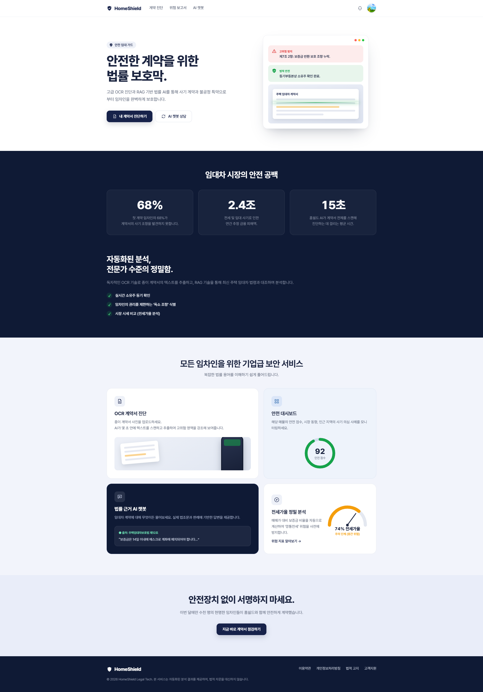

### 1-2. 로그인

- 카카오 계정 또는 이메일·비밀번호로 로그인할 수 있습니다.
- 아이디 저장, 비밀번호 찾기, 회원가입 이동 기능을 제공합니다.

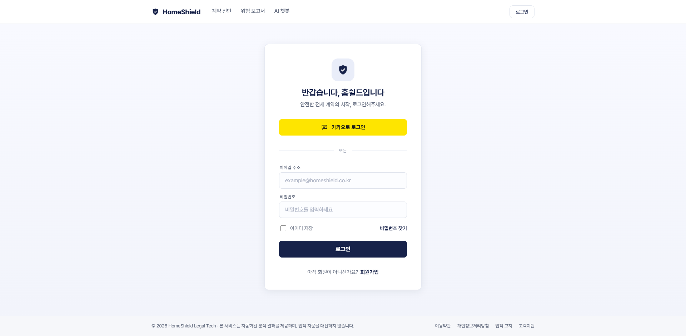

### 1-3. 회원가입 방식 선택

- 카카오 또는 이메일 회원가입 방식을 선택합니다.
- 필수 이용약관·개인정보 처리방침과 선택 마케팅 수신 동의를 구분해 확인할 수 있습니다.

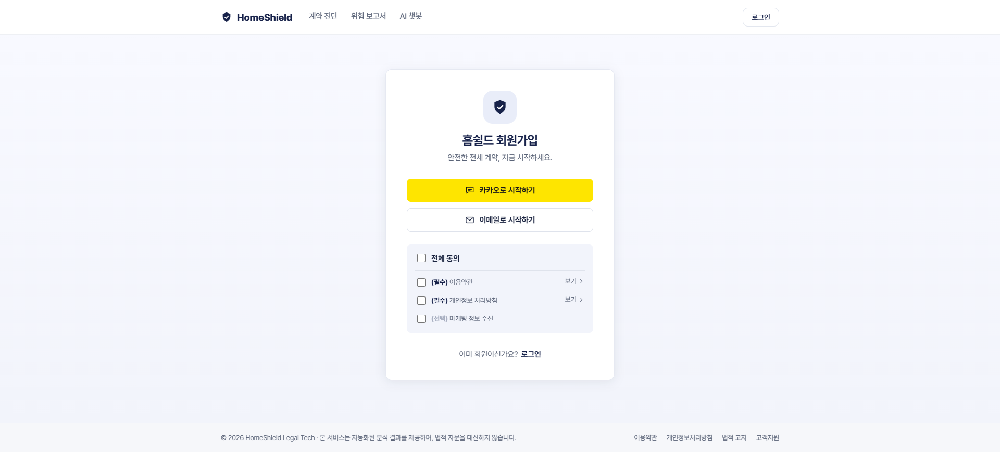

### 1-4. 이메일 회원가입

- 이메일, 닉네임, 비밀번호, 비밀번호 확인 정보를 입력합니다.
- 약관 동의를 완료한 뒤 이메일 계정으로 가입할 수 있습니다.

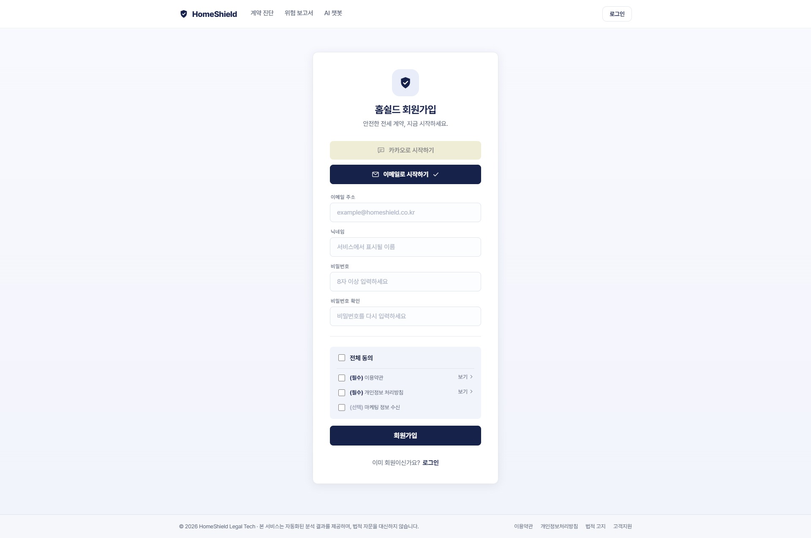

## 2. 계약 진단

### 2-1. 진단 서류 업로드 전

- 임대차계약서, 등기부등본, 건축물대장을 각각 업로드합니다.
- 세 서류가 모두 준비되기 전에는 OCR 진단 버튼이 비활성화됩니다.
- 하단에서 각 서류의 발급처와 준비 방법을 확인할 수 있습니다.

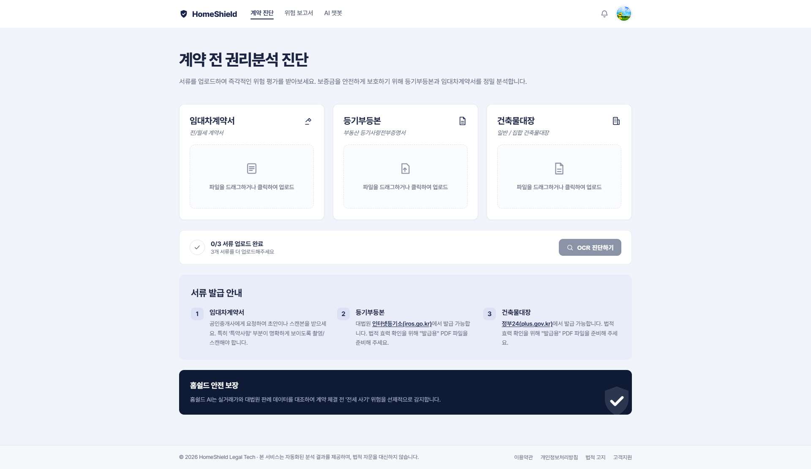

### 2-2. 진단 서류 업로드 완료

- 업로드한 파일명과 크기를 확인하고 파일을 추가하거나 삭제할 수 있습니다.
- 필수 서류 3종이 모두 준비되면 업로드 완료 상태가 표시되고 분석 접수가 진행됩니다.

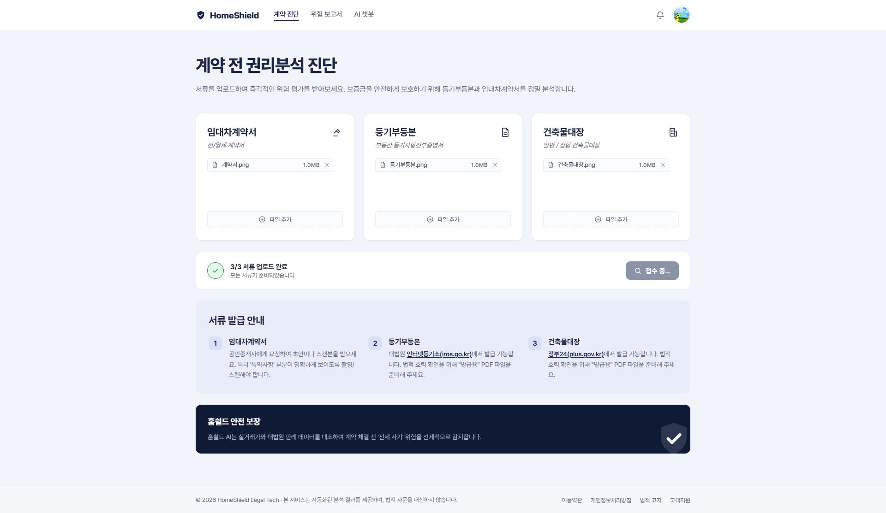

### 2-3. AI 분석 시작

- 분석 예상 시간과 백그라운드 처리, 완료 알림 방식을 안내합니다.
- 창을 닫고 다른 기능을 이용할 수 있으며, 대기 중 AI 상담으로 바로 이동할 수 있습니다.

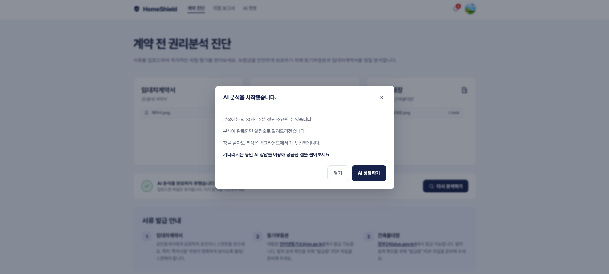

## 3. 위험 보고서

### 3-1. 분석 내역 없음

- 아직 분석한 계약서가 없을 때 표시되는 빈 상태 화면입니다.
- `계약서 분석하기` 버튼을 통해 계약 진단 화면으로 이동합니다.

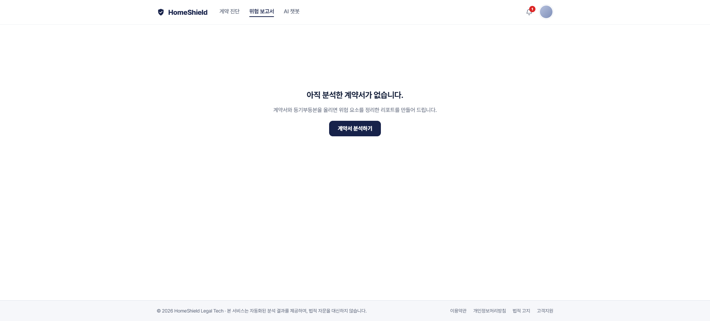

### 3-2. 최근 진단 내역

- 최근 분석한 계약서의 파일명, 진단 일시, 위험 등급을 목록으로 확인합니다.
- 새 계약서 분석, 개별 항목 메뉴, 더 보기 기능을 제공합니다.

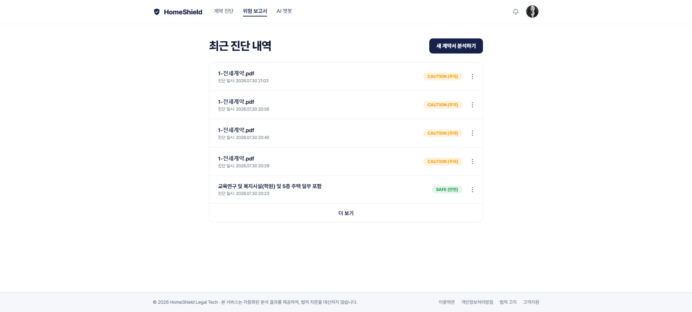

### 3-3. 종합 리스크 리포트

- 종합 안전 점수와 계약 요약을 가장 먼저 보여줍니다.
- 계약 유형·보증금·기간 등 주요 조건과 위험도를 함께 표시합니다.
- 특약 분석, 권장 조치, 주거 형태와 위치 정보를 확인하고 결과를 PDF로 내려받을 수 있습니다.

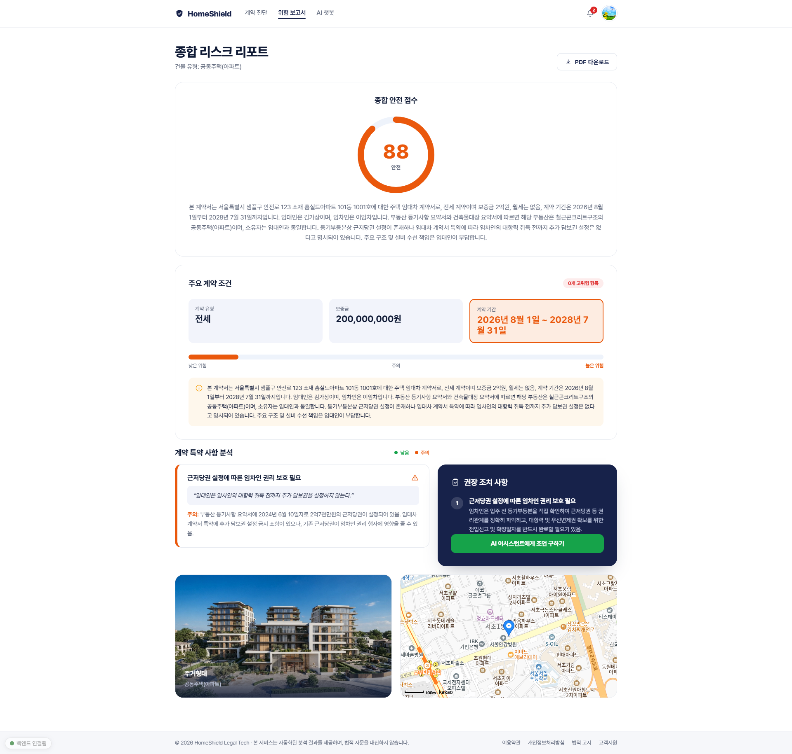

## 4. AI 챗봇

### 4-1. 전·월세 법률 상담

- 왼쪽 사이드바에서 새 대화를 만들고 기존 대화 기록을 확인합니다.
- 보증금 반환, 수리비 분쟁, 계약 갱신 청구권, 해지 통보 시점 등의 추천 주제를 제공합니다.
- 예시 질문을 선택하거나 직접 질문을 입력해 관련 법령·판례 기반 답변을 받을 수 있습니다.

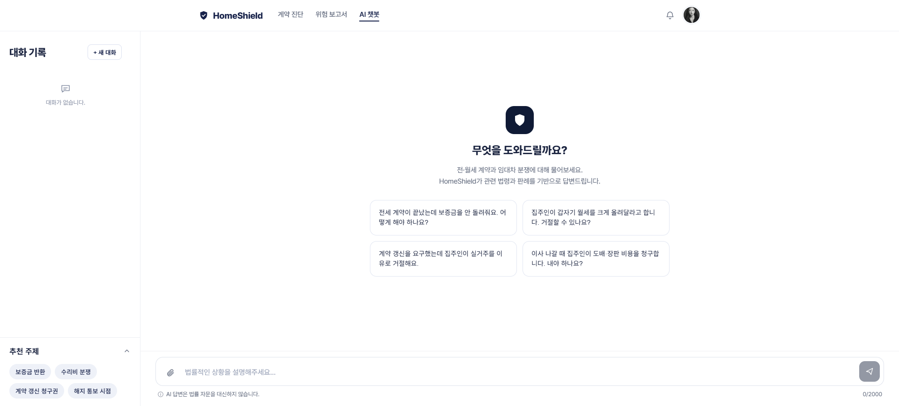

### 4-2. AI 챗봇 상담

- 사용자의 전·월세 관련 질문과 HomeShield 봇의 답변을 대화 형태로 보여줍니다.
- 공공 기록과 관련 법령을 바탕으로 답변하며, 상단에서 법률 자문을 대신하지 않는다는 안내를 제공합니다.
- 왼쪽 대화 기록에서 이전 상담을 다시 확인하거나 새 대화를 시작할 수 있습니다.

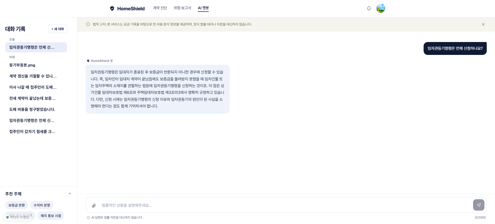

## 5. 알림·마이페이지

### 5-1. 전체 알림

- 전체 알림과 읽지 않은 알림을 탭으로 구분합니다.
- 알림 선택, 모두 읽음, 전체 삭제 기능을 제공합니다.

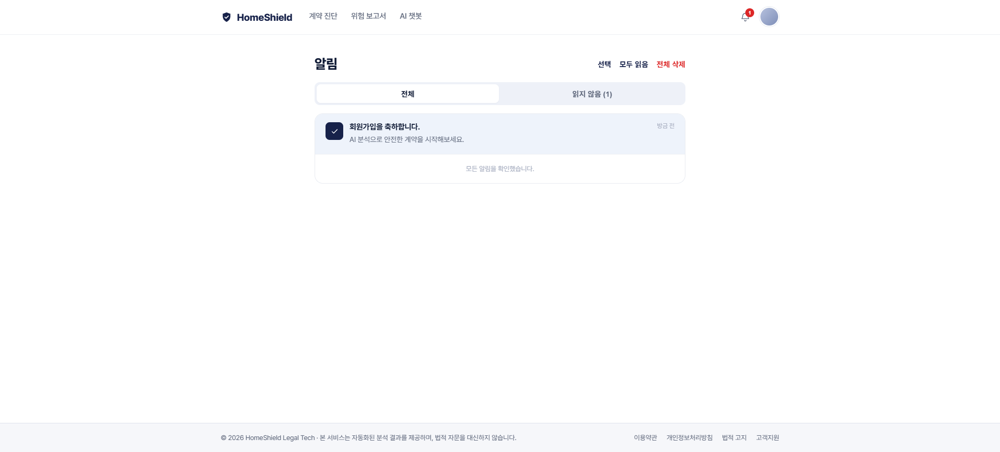

### 5-2. 읽지 않은 알림

- 읽지 않은 알림만 모아서 확인합니다.
- 대상 알림이 없을 때 빈 상태 메시지를 표시합니다.

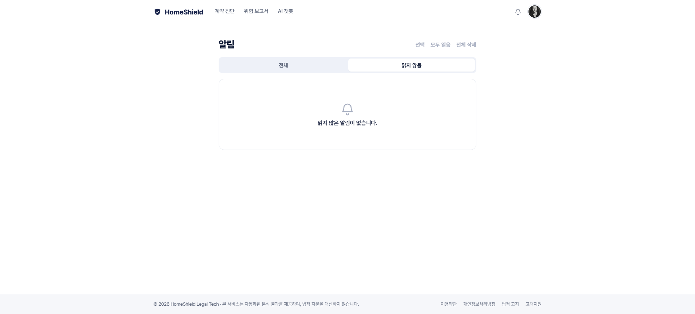

### 5-3. 마이페이지

- 프로필 이미지와 닉네임을 수정하고 로그인 경로를 확인합니다.
- 최근 진단 내역과 상담 내역을 조회합니다.
- 비밀번호, 위험 보고서 완료 알림 설정과 회원 탈퇴 기능을 제공합니다.

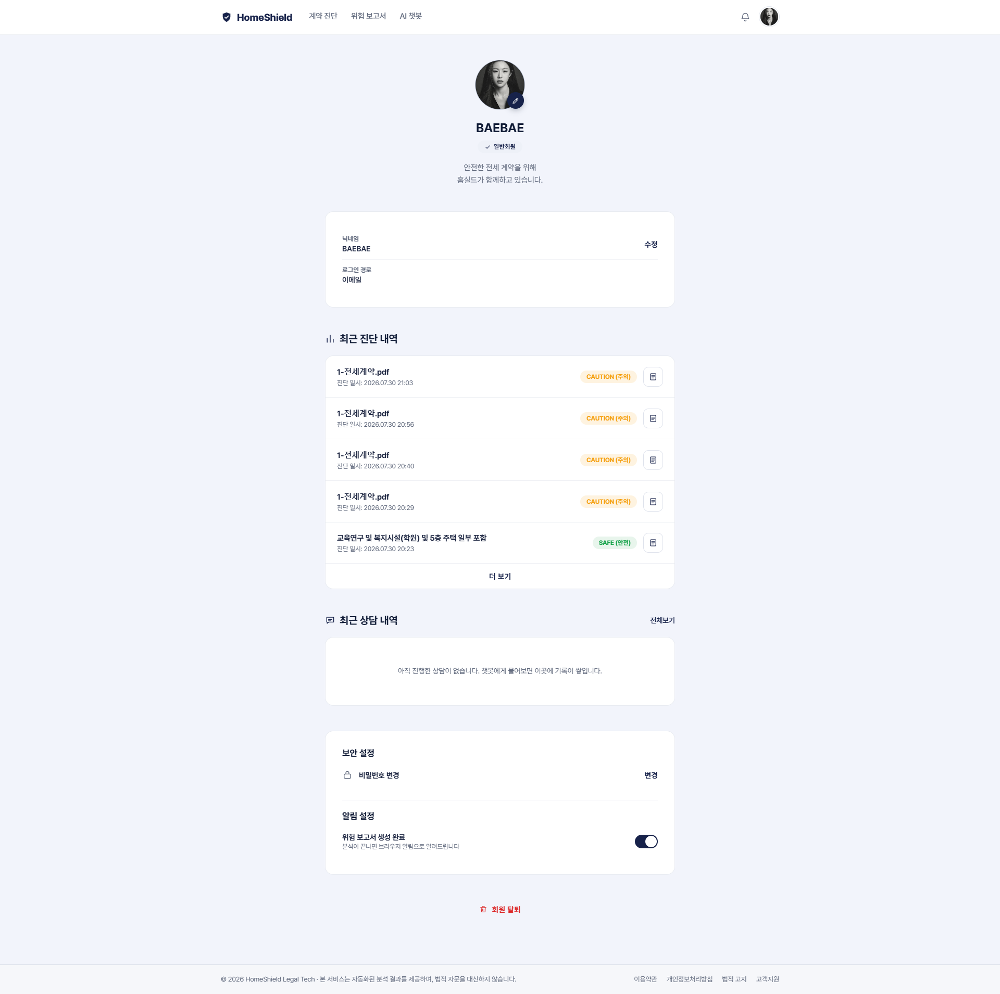
